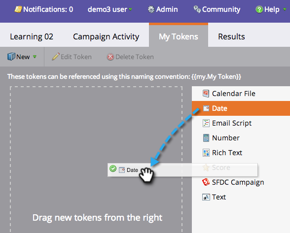

# Mijn tokens beheren {#managing-my-tokens}

Het gebruik van tokens kan uw inspanningen in Marketo vereenvoudigen. U kunt [Mijn tokens](/help/marketo/product-docs/core-marketo-concepts/programs/tokens/understanding-my-tokens-in-a-program.md){target="_blank"} (aangepaste tokens) in stroomstappen, webhooks, e-mails en bestemmingspagina&#39;s. Zo maak je ze.

>[!TIP]
>
>Meer informatie over de tokens die al beschikbaar zijn in [Overzicht van tokens](/help/marketo/product-docs/demand-generation/landing-pages/personalizing-landing-pages/tokens-overview.md){target="_blank"}.

## Mijn token maken {#create-a-my-token}

1. Ga naar **[!UICONTROL Marketing Activities]**.

   

1. Selecteer een programma- of campagnemap. Klik op **[!UICONTROL My Tokens]**.

   

1. Selecteer een **[!UICONTROL My Token]** type. Sleep het naar het canvas.

   

1. Typ een unieke naam. Voer een relevante waarde voor het token in.

   

1. Klik op **[!UICONTROL Save]**.

   

   Yay! Je hebt mijn token gemaakt.

   

## Mijn token bewerken {#edit-a-my-token}

1. Dubbelklik op de knop **[!UICONTROL My Token]** en breng uw wijzigingen aan. Klikken **Opslaan**.

   

## Mijn token verwijderen {#delete-a-my-token}

>[!CAUTION]
>
>Wanneer u een Mijn token verwijdert, moet u ervoor zorgen dat er niet naar wordt verwezen in een element. Een lege ruimte wordt weergegeven op elke plaats waarnaar wordt verwezen als deze wordt verwijderd.

1. Klik met de rechtermuisknop op de knop **[!UICONTROL My Token]**. Selecteren **[!UICONTROL Delete Token]**.

   

1. Klik op **[!UICONTROL Delete]**.

   

   >[!MORELIKETHIS]
   >
   >* [Overzicht van tokens](/help/marketo/product-docs/demand-generation/landing-pages/personalizing-landing-pages/tokens-overview.md){target="_blank"}
   >* [Mijn tokens in een programma begrijpen](/help/marketo/product-docs/core-marketo-concepts/programs/tokens/understanding-my-tokens-in-a-program.md){target="_blank"}
   >* [URL&#39;s gebruiken in Mijn tokens](/help/marketo/product-docs/email-marketing/general/using-tokens/using-urls-in-my-tokens.md){target="_blank"}
