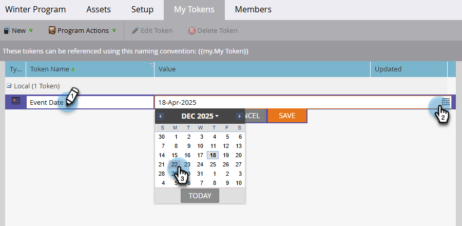

# Mijn tokens beheren {#managing-my-tokens}

Het gebruik van tokens kan uw inspanningen in Marketo Engage vereenvoudigen. U kunt [&#x200B; Mijn Tokens &#x200B;](/help/marketo/product-docs/core-marketo-concepts/programs/tokens/understanding-my-tokens-in-a-program.md){target="_blank"} (douanetokens) in stroomstappen, webhooks, e-mail, en het Landing Pagina&#39;s gebruiken. Zo maak je ze.

>[!TIP]
>
>Leer meer over welke tekenen reeds beschikbaar in [&#x200B; het Overzicht van Tokens &#x200B;](/help/marketo/product-docs/demand-generation/landing-pages/personalizing-landing-pages/tokens-overview.md){target="_blank"} zijn.

## Een lokaal of globaal My Token maken {#create-a-my-token}

>[!BEGINTABS]

>[!TAB  Lokale Mijn Tokens ]

1. Selecteer in **[!UICONTROL Marketing Activities]** het gewenste programma of de gewenste campagnemap en klik op de tab **[!UICONTROL My Tokens]** ervan.

   

1. Sleep de gewenste token naar het canvas.

   

1. Typ een unieke naam en voer een relevante waarde in.

   

1. Klik op **[!UICONTROL Save]**.

   

>[!TAB  Globale Mijn Tokens ]

>[!NOTE]
>
>Beheerdersmachtigingen vereist.

1. Ga naar het **[!UICONTROL Admin]** -gebied en selecteer **[!UICONTROL My Tokens]** .

   

1. Sleep de gewenste token naar het canvas.

   

1. Typ een unieke naam en voer een relevante waarde in.

   

1. Klik op **[!UICONTROL Save]**.

   

>[!ENDTABS]

## Mijn token bewerken {#edit-a-my-token}

1. Selecteer het token dat u wilt bewerken en klik op **[!UICONTROL Edit Token]** .

   

1. Breng de gewenste wijzigingen aan. Klik op **[!UICONTROL Save]** als u klaar bent.

   

## Mijn token verwijderen {#delete-a-my-token}

>[!CAUTION]
>
>Wanneer u een Mijn token verwijdert, moet u ervoor zorgen dat er in geen enkel element naar wordt verwezen. Een lege ruimte wordt weergegeven op elke plaats waarnaar wordt verwezen als deze wordt verwijderd.

1. Selecteer het token dat u wilt verwijderen en klik op **[!UICONTROL Delete Token]** .

   

1. Klik op **[!UICONTROL Delete]**.

   

   >[!MORELIKETHIS]
   >
   >* [&#x200B; Tokens Overzicht &#x200B;](/help/marketo/product-docs/demand-generation/landing-pages/personalizing-landing-pages/tokens-overview.md){target="_blank"}
   >* [&#x200B; Begrijpend Mijn Tokens in een Programma &#x200B;](/help/marketo/product-docs/core-marketo-concepts/programs/tokens/understanding-my-tokens-in-a-program.md){target="_blank"}
   >* [&#x200B; Gebruikend URLs in Mijn Tokens &#x200B;](/help/marketo/product-docs/email-marketing/general/using-tokens/using-urls-in-my-tokens.md){target="_blank"}
