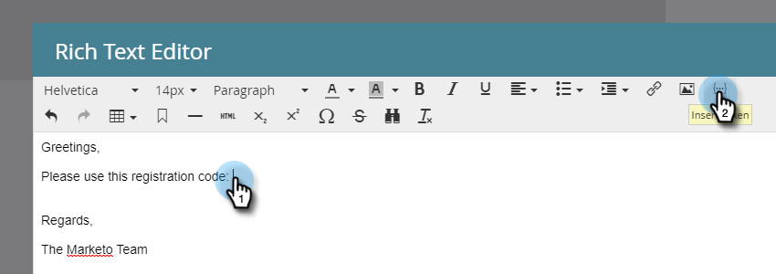
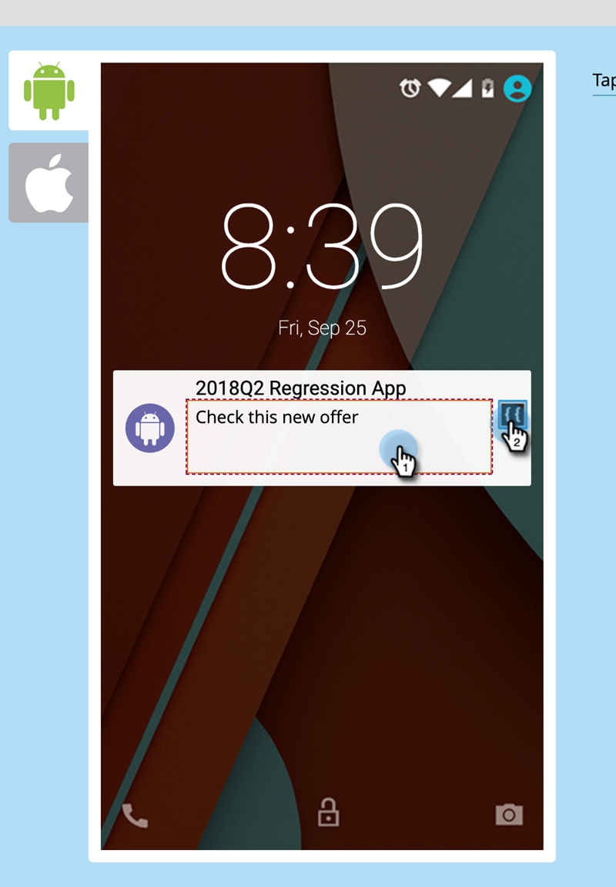

# Aangepaste veldtokens voor programmaleden {#program-member-custom-field-tokens}

## Token Support voor aangepaste velden voor programmalid {#token-support-for-program-member-custom-fields}

Op de rug van de eigenschappen van de Gebieden van de Douane van het Lid van het Programma, wordt de steun uitgebreid voor de Gebieden van de Douane van het Lid van het Programma in symbolische kaders.

De PMCF-tokens worden ondersteund onder het liddomein van de tokens-familie.

Lid Tokens worden gebruikt voor gebieden die onder het werkingsgebied van het Lid van het Programma vallen. Vanaf huidige staat, worden de Tokens van het Lid ook gebruikt om unieke waarden van geïntegreerde de dienstenpartners op te nemen. `{{member.webinar url}}` wordt automatisch de unieke bevestiging-URL van de persoon die door de serviceprovider is gegenereerd, opgelost. {{member.registration code}} wordt omgezet in de registratiecode die door de dienstverlener wordt verstrekt.

>[!NOTE]
>
>* Aangepaste velden voor programmalid kunnen alleen worden gebruikt in de context van een programma.
>* De Tokens van de Gebieden van het Lid van het programma kunnen niet in worden gebruikt: e-mail preheader, de Tokens van de Datum in Wacht Stappen, of Fragmenten.
>* De status van het programma Lid wordt niet gesteund in de Tokens van de Lidstaten.

## Aangepaste veldtokens van programmalid gebruiken in elementen {#using-program-member-custom-field-tokens-in-assets}

U kunt de Tokens van de Gebieden van het Lid van het Programma in e-mail, het Bestaan van Pagina&#39;s, SMS, dupberichten en Webhooks opnemen.

**E-mails**

1. Selecteer het gewenste e-mailbericht en klik op **[!UICONTROL Edit Draft]**.

   

1. Klik op het pictogram Token invoegen.

   

1. Zoek en selecteer het gewenste Token van het Gebied van het Lid van het Programma, ga een standaardwaarde in, en klik **[!UICONTROL Insert]**.

   

1. Klik op **[!UICONTROL Save]**.

   

>[!NOTE]
>
>Vergeet niet uw e-mail goed te keuren.

**Landingspagina&#39;s**

1. Selecteer uw bestemmingspagina en klik **[!UICONTROL Edit Draft]**.

   

   >[!NOTE]
   >
   >De landende paginaontwerper opent in een nieuw venster.

1. Dubbelklik op het tekstvak Rich waaraan u het token wilt toevoegen.

   

1. Klik op de plaats waar de token moet komen en klik vervolgens op het pictogram Token invoegen.

   

1. Zoek en selecteer het gewenste token.

   

1. Voer een standaardwaarde in en klik op **[!UICONTROL Insert]**.

   

1. Klik op **[!UICONTROL Save]**.

   

**SMS**

1. Selecteer het gewenste SMS en klik op **[!UICONTROL Edit Draft]**.

   

1. Klik op de knop **`{{ Token`** knop.

   

1. Zoek en selecteer de gewenste token voor het aangepaste veld voor programmalid. Voer een standaardwaarde in en klik op Invoegen.

   

1. Klik op de vervolgkeuzelijst SMS-handelingen en selecteer **[!UICONTROL Approve & Close]**.

   

**Pushmeldingen**

1. Selecteer de gewenste pushmelding en klik op **[!UICONTROL Edit Draft]**.

   

1. Klik op **[!UICONTROL Push Notification]**.

   

1. Klik op het bericht in de editor en klik op de knop `{{` om de tokenkiezer op te halen.

   

1. Zoek en selecteer de gewenste token voor het aangepaste veld voor programmalid. Voer een standaardwaarde in en klik op **[!UICONTROL Insert]**.

   

1. Klikken **[!UICONTROL Finish]** om op te slaan en af te sluiten (of **[!UICONTROL Next]** eerst controleren).

   

>[!NOTE]
>
>Als het veld Aangepast voor programmalid voor een lid van het programma geen waarde heeft, wordt de token vervangen door de standaardwaarde als deze is opgegeven.

## Aangepaste veldtokens van programmalid gebruiken in campagnes {#using-program-member-custom-field-tokens-in-campaigns}

Aangepaste veldtokens van programmalid kunnen worden gebruikt in:

* Taak maken
* Taak maken in Microsoft
* Interesserende momenten
* Handelingen voor gegevenswaardemomloop wijzigen
* Webhaken
