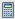

# Mijn tokens in een programma begrijpen {#understanding-my-tokens-in-a-program}

Een token is een variabele die u kunt gebruiken in e-mails, Landing Pages en Slimme campagnes om uw leven eenvoudiger te maken.

Naast Mijn tokens kunt u ook alle ingebouwde tokens in uw programma&#39;s gebruiken. Controle uit het [ Overzicht van Tokens ](/help/marketo/product-docs/demand-generation/landing-pages/personalizing-landing-pages/tokens-overview.md){target="_blank"}.

## Mijn tokens  {#my-tokens}

Mijn tokens zijn aangepaste variabelen die iedereen kan maken. Lokaal, worden zij [ gecreeerd ](/help/marketo/product-docs/core-marketo-concepts/programs/tokens/managing-my-tokens.md){target="_blank"} in of campagnemappen of programma&#39;s.

Mijn tokens worden als volgt weergegeven: `{{my.Name Of Token}}`

Voorbeelden:

* `{{my.Event Date}}`
* `{{my.Webinar Speaker}}`

<table> 
 <thead> 
  <tr> 
   <th>Type token</th> 
   <th>Beschrijving</th> 
  </tr> 
 </thead> 
 <tbody> 
  <tr> 
   <td>Kalenderbestand </td> 
   <td>Gebruik dit teken om <a href="/help/marketo/product-docs/email-marketing/general/functions-in-the-editor/create-a-calendar-event-ics-file.md"> een dossier van de kalendergebeurtenis (.i </a> toe te voegen <a href="/help/marketo/product-docs/email-marketing/general/functions-in-the-editor/create-a-calendar-event-ics-file.md"> cs) </a> aan uw e-mail en landende pagina's.</td> 
  </tr> 
  <tr> 
   <td>
Datum 
</td> 
   <td>Dit token bevat een datumwaarde. De datum wordt weergegeven als dag van de maand (bijvoorbeeld 2016-05-23).</td> 
  </tr> 
  <tr> 
   <td>E-mailscript </td> 
   <td>Gebruik deze token om een snelheidsscript in uw e-mails uit te voeren. Leer meer <a href="https://experienceleague.adobe.com/en/docs/marketo-developer/marketo/email-scripting" title="Koppeling volgen" rel="nofollow"> hier </a>. </td> 
  </tr> 
  <tr> 
   <td>Number  </td> 
   <td>Een geheel getal. Het kan zelfs negatief zijn.</td> 
  </tr> 
  <tr> 
   <td>RTF </td> 
   <td>Dit is HTML. Gebruik dit in e-mails en landingspagina's.</td> 
  </tr> 
  <tr> 
   <td>Score </td> 
   <td>Gebruik dit teken in de <a href="/help/marketo/product-docs/core-marketo-concepts/smart-campaigns/flow-actions/use-tokens-in-flow-steps.md"> stap van de veranderingsscore stroom </a>. </td> 
  </tr> 
  <tr> 
   <td colspan="1">SFDC-campagne </td> 
   <td colspan="1">Gebruik deze token om toe te staan dat leads die onderdeel worden van een Marketo-programma ook worden toegevoegd aan een SFDC-campagne.</td> 
  </tr> 
  <tr> 
   <td>Tekst </td> 
   <td>Gewoon wat tekst. Gebruik het als HTML overbelast is. De formaatlimiet voor Text-tokens is 524.288 tekens (UTF-8) of 2 MB.</td> 
  </tr> 
 </tbody> 
</table>

>[!CAUTION]
>
>Mijn tokens worden niet opgelost wanneer een e-mail van Sales Insight wordt verzonden op [!DNL Microsoft Dynamics] of [!DNL Salesforce] . Alleen standaardtokens worden gevuld (Lead, Company, enz.). De standaardwaarden voor tokens _zullen_ werken, echter.

## Nesten van tokens {#nesting-tokens}

Wanneer u een nieuw token maakt, kan hiernaar worden verwezen door andere objecten in de structuur. Er is een naamgevingsstructuur voor de plaats waar het token is gemaakt voor eenvoudig beheer.

* **Lokale Token:** het teken werd gecreeerd recht in dat programma of omslag.
* **Geërft Symbolisch:** het token werd omhoog gecreeerd omhoog de boom ergens in een hoger niveauprogramma of een omslag.
* **met voeten getreden Token:** het teken werd geërft en toen maakte iemand een uitzondering in dit programma of deze omslag.

U kunt globale variabelen maken en dan hen met voeten treden op lagere niveaus in de boom.

Het verplaatsen van programma&#39;s en omslagen beïnvloedt ook tokens. Controleer altijd of verwijzingen niet worden verbroken tijdens het verplaatsen.

>[!IMPORTANT]
>
>Geneste tokens worden niet gesteund in [ Campagnes van de Partij ](/help/marketo/product-docs/core-marketo-concepts/smart-campaigns/creating-a-smart-campaign/understanding-batch-and-trigger-smart-campaigns.md#batch-campaign){target="_blank"}.

>[!NOTE]
>
>Als de e-mail die u verzendt vanuit een betrokkenheidsprogramma een onderliggende e-mail is van een standaardprogramma (niet lokaal naar uw betrokkenheidsprogramma), worden alle My Tokens die in de e-mail worden gebruikt, opgelost vanuit het standaardprogramma waarin de onderliggende e-mail zich bevindt.

>[!MORELIKETHIS]
>
>* [ Tokens Overzicht ](/help/marketo/product-docs/demand-generation/landing-pages/personalizing-landing-pages/tokens-overview.md){target="_blank"}
>* [ het leiden Mijn Tokens ](/help/marketo/product-docs/core-marketo-concepts/programs/tokens/managing-my-tokens.md){target="_blank"}
