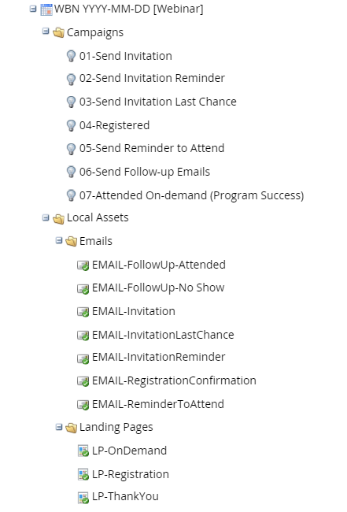

# Beste praktijken: Hoe te om uw Programma&#39;s te organiseren {#best-practice-how-to-organize-your-programs}

Er zijn vele manieren om de boom in de Activiteiten van de Marketing evenals de inhoud van één enkel programma te organiseren. Sommige manieren zijn echter beter en zullen mensen in uw marketingafdeling helpen.

>[!TIP]
>
>Op een dag (wanneer je gepromoveerd wordt!) probeert iemand anders je programma&#39;s te begrijpen. Goede organisatie zal hen helpen snel productief te zijn.

## Mappen {#folders}

Bij marketingactiviteiten moet u mappen gebruiken om uw programma&#39;s te organiseren. De structuur die we aanbevelen, bevindt zich in het volgende voorbeeld:

>[!NOTE]
>
>**Voorbeeld**
>
>* Actieve marketingprogramma&#39;s
>   * E-mails
>   * Gebeurtenissen
>     * Live gebeurtenissen/presentaties
>     * Tradeshows
>     * Webinars
>   * Nieuwsbrieven
>   * Verloop
>   * Webinhoud
>   * Webformulieren
>* Learning
>* Operationeel
>   * Levenscyclus
>   * Scores
>   * Gegevensbeheer
>* VerkoopInsight
>   * Interesserende momenten
>   * Verkoop-e-mails
>   * Verkoop aangevraagde campagnes
>* **Archief**
>   * Gebeurtenissen archiveren
>     * Archief 2012
>     * Archief 2013

Elk van deze die in het voorbeeld worden vermeld is een omslag. U ziet hoe ze allemaal een unieke naam hebben. U kunt dubbele (eenvoudigere) namen van omslagen hebben INSIDE programma&#39;s, maar niet bij de wortel van de boom.

>[!TIP]
>
>De map &quot;Archiveren&quot; is een speciaal soort map waarmee zowel items uit geselecteerde lijsten als rapportage kunnen worden verwijderd. Hierdoor wordt uw systeem sneller uitgevoerd. Leer [ meer over omslagen ](/help/marketo/product-docs/core-marketo-concepts/miscellaneous/understanding-folders.md){target="_blank"}.

U kunt zeker meer mappen toevoegen als u dat wilt. Houd er rekening mee dat toekomstige generaties van marketers in uw bedrijf met uw beslissingen zullen leven over hoe u dingen kunt benoemen/organiseren.

## Naamgevingsschema&#39;s {#naming-schemes}

Naamgeving is essentieel, omdat Marketo-functies allemaal een gemeenschappelijke taal gebruiken om te communiceren. Voor programma&#39;s, zou u hen iets uniek moeten noemen. **Geen twee programma&#39;s kunnen de zelfde naam** hebben. U kunt het beste de volgende indeling gebruiken:

[ Afkorting van het Type van Programma ] [ YYYY ] - [ MM. ] - [ Facultatieve DD ] [ Korte Beschrijving ]

>[!NOTE]
>
>**Voorbeeld**
>
>Voorbeelden van programmamenamen:
>
>1. ES 2015-09-21 Widget Intro
>1. NL 2015-06 Nieuwsbrief
>1. WBN 2015-12-01 Webinar-onderwerp hier

De namen van het programma moeten in uw abonnement, zelfs in verschillende [ werkruimten ](/help/marketo/product-docs/administration/workspaces-and-person-partitions/understanding-workspaces-and-person-partitions.md){target="_blank"} uniek zijn.  Voor de lokale activa binnen programma&#39;s, moet de regel **de naam eenvoudig houden**. Noem enkel een uitnodiging &quot;Uitnodiging,&quot;in tegenstelling tot &quot;Uitnodiging van de Webinar van 2015 Juni.&quot; Omdat deze zich in een programma bevinden, maakt het bovenliggende programma automatisch deel uit van de naam wanneer u deze elders kiest. Met andere woorden, lokale middelen hoeven alleen binnen het programma uniek te zijn. U kunt honderden elementen met de naam &quot;Uitnodigen&quot; hebben in een ander programma en het zal u niet in de war brengen.

## Tokens {#tokens}

Voor tokens worden mappen en programma&#39;s gebruikt als een medium om variabelen in te stellen die moeten worden gebruikt bij het landen van pagina&#39;s, e-mails en andere elementen.

Met de hierboven vermelde organisatie kunt u tokens in de map Event plaatsen, zodat deze in alle gebeurtenissen trapsgewijs worden weergegeven.

>[!NOTE]
>
>**Voorbeeld**
>
>**Uw collectief adres**. Gebruik een token in plaats van het telkens opnieuw te schrijven. Op die manier kunt u het bestand op één locatie bijwerken zonder dat u veel concepten hoeft te maken. Overschrijf vervolgens zo nodig het token in een map op een lager niveau.

## Gebeurtenissen {#events}

Een gebeurtenis heeft meestal veel bewegende onderdelen, zoals uitnodigingen, bestemmingspagina&#39;s, formulieren, sociale widgets en slimme campagnes. De beste manier om deze voor gebruiksgemak te organiseren is door de fase van de gebeurtenis. Hier ziet u een voorbeeld van hoe de mappenstructuur naar een gebeurtenis moet zoeken.

## Betrokkenheidsprogramma&#39;s {#engagement-programs}

Leer [ allen over betrokkenheidsprogramma&#39;s ](/help/marketo/product-docs/email-marketing/drip-nurturing/creating-an-engagement-program/understanding-engagement-programs.md){target="_blank"}. De beste manier om uw betrokkenheidsprogramma te organiseren is met mappen. Maak een map voor elke stream en plaats de e-mails of programma&#39;s in die map. Neem in elke stream een archiefmap op wanneer de inhoud wordt verkocht en u wilt deze verwijderen.

## Operationele programma&#39;s {#operational-programs}

Deze worden gebruikt voor het opschonen van gegevens. Mappen hebben voor de datums waarop de programma&#39;s zijn uitgevoerd en vervolgens de mappen archiveren. Door het programma operationeel te maken, laat u het uit de rapportage, wat goed is voor dit soort activiteiten.

## E-mailprogramma&#39;s nesten {#nesting-email-programs}

E-mailprogramma&#39;s zijn ontworpen als een tool voor het blasten van e-mail. U kunt ze in Gebeurtenissen of andere programma&#39;s plaatsen voor promoties, uitnodigingen en herinneringen. Ze worden geleverd met een koel dashboard en andere A/B-testfuncties. Bovendien, worden zij gemakkelijk gemanipuleerd in de mening van het programmaprogramma.

U kunt ook een e-mailprogramma maken als een zelfstandig programma. E-mailprogramma&#39;s zijn niet toegestaan in andere e-mailprogramma&#39;s. Dat zou gek zijn!

## Klonen {#cloning}

Een van de mooiste functies van Marketo is de mogelijkheid om programma&#39;s te klonen. Dit betekent dat u een programma &#39;sjabloon&#39; kunt instellen met alle gewenste slimme campagnes en e-mails. Stel het vooraf in en kloon het voor uw volgende marketinginitiatief.

>[!TIP]
>
>Let op de gebeurtenissjablonen in het voorbeeld bovenaan. Plaats daar uw verschillende soorten gebeurtenissen voor eenvoudig klonen.

Sommige mensen onttrekken zelfs het grootste deel van de tekst in de e-mails en plaatsen pagina&#39;s in tokens. Hierdoor kunt u de tokens klonen en vervolgens bewerken. Tot slot ga naar de mening van het programmaprogramma en pas de data aan en u wordt gebeëindigd. Voilà!

## Samenvatting {#summary}

Zoals je ziet, is er veel macht in Marketo. Wij behandelden de grondbeginselen hier, maar overweeg de extra diensten van [ deskundigen van Marketo Engage ](https://business.adobe.com/products/marketo/services-support.html){target="_blank"} aan verfijning en opstelling voor succes.
