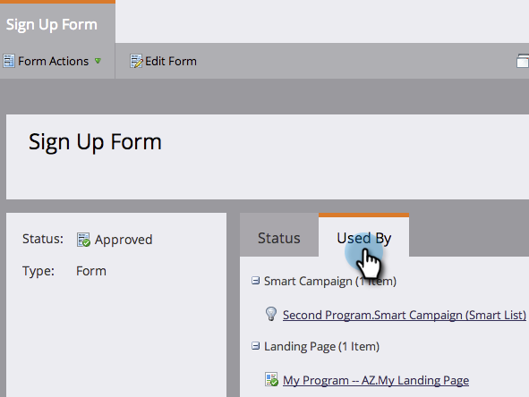

# Een programma verwijderen {#delete-a-program}

Je kunt een programma archiveren, maar soms wil je er gewoon permanent van af. Zo gaat het.

1. Selecteer het programma dat u wilt verwijderen.

1. Klik op Programmaacties. Klik op Verwijderen.

   

1. Selecteer de optie Alles verwijderen. Controleer de bijwerkingen van de verwijdering van het programma en klik vervolgens op Verwijderen om te bevestigen.

>[!TIP]
>
>**Met Archiveringsprogramma** &#39;s blijven de programmagegevens behouden, maar wordt het programma uit uw weg gezet. Selecteer die optie en klik op **Volgende** om meer informatie over archivering weer te geven.

Gereed. Het is alsof het programma nooit bestond.

## Waarom kan ik mijn programma niet verwijderen? {#why-cant-i-delete-my-program}

Programma&#39;s kunnen elementen bevatten die elders in het systeem worden gebruikt. Hierdoor kunt u geen programma verwijderen.

Mogelijk moet u naar beneden bogen en verwijderen om het probleem op te lossen. Voer de volgende stappen uit.

1. Klik op de koppeling om naar het element te gaan.

   

1. Klik op **Gebruikt** **door** om te zien waar het element in gebruik is.

   

   Als u weet waar uw middel wordt gebruikt, gaat u naar het en keurt u het niet goed of verwijdert u het. Probeer het programma vervolgens opnieuw te verwijderen.

