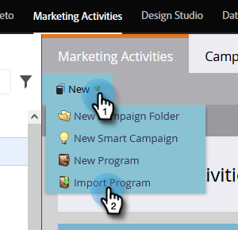

# Een programma importeren {#import-a-program}

Een programma kan worden geïmporteerd van het ene Marketo Engage-abonnement naar het andere. U kunt bijvoorbeeld een programma maken in een sandbox en dit vervolgens importeren in uw live abonnement. Ook, kunt u een vooraf gebouwd programma van de [&#x200B; Bibliotheek van het Programma van Marketo invoeren &#x200B;](/help/marketo/product-docs/core-marketo-concepts/programs/program-library/program-import-library-overview.md){target="_blank"}.

>[!CAUTION]
>
>Programma&#39;s met slimme lijsten met een trigger &quot;Aangepast object is bijgewerkt&quot; zullen ertoe leiden dat het importeren mislukt. Verwijder deze trigger uit alle slimme lijsten voordat u de onderstaande stappen uitvoert.

## Een programma importeren {#importing-a-program}

1. Ga naar **[!UICONTROL Marketing Activities]** .

   

1. Klik op de vervolgkeuzelijst **[!UICONTROL New]** en selecteer **[!UICONTROL Import Program]** .

   

   >[!NOTE]
   >
   >* De Invoer van het programma is slechts beschikbaar voor gebruikers die rollen hebben met toegelaten de toestemming van het Programma van de Invoer. Leer meer over [&#x200B; het beheren van gebruikersrollen en toestemmingen &#x200B;](/help/marketo/product-docs/administration/users-and-roles/managing-user-roles-and-permissions.md){target="_blank"}.
   >
   >* Om een zandbakrekening met uw levend abonnement aan te sluiten, contacteer [&#x200B; de Steun van Marketo &#x200B;](https://nation.marketo.com/t5/Support/ct-p/Support){target="_blank"}.

1. Selecteer een Marketo **[!UICONTROL Subscription]** en een programma om te importeren. Klik op **[!UICONTROL Next]**.

   

1. Geef een **[!UICONTROL Campaign Folder]** op voor het geïmporteerde programma. Klik op **[!UICONTROL Next]**.

   

   >[!NOTE]
   >
   >Zorg ervoor dat **[!UICONTROL Use default conflict]** -regels zijn geselecteerd. Conflictregels zijn nodig wanneer u programma&#39;s importeert in een instantie met elementen met dezelfde naam.

1. Kies de gewenste conflictdetails en klik op **[!UICONTROL Next]** .

   

   >[!NOTE]
   >
   >Het invoeren van een programma dat de Stappen van de Stroom van de Douane, of de Slimme regels van de Lijst gebruikt die van de Dienst van de Stap van de Stroom in een bestemmingsinstantie worden afgeleid waar er meer dan één compatibele dienstverlener is, zal de het invoeren gebruiker worden ertoe aangezet om stappen of regels aan de correcte dienstverlener in de bestemmingsinstantie toe te wijzen.

1. Geef een voorvertoning weer van de details en **[!UICONTROL Import]** het programma.

   

U ontvangt een e-mailbevestiging zodra het importeren is voltooid.

>[!NOTE]
>
>U moet geïmporteerde batchcampagnes opnieuw plannen en triggercampagnes activeren. Het systeem deactiveert automatisch campagnematerialen en activeert campagnes in het geïmporteerde programma.

## Gevolgen voor externe Assets tijdens de invoer van het programma {#impact-on-external-assets-during-program-imports}

De programma&#39;s gebruiken externe activa zoals e-mailmalplaatjes, de malplaatjes van de Landing van de Pagina, beelden, vormen, tekenen, en programmamarkeringen. U kunt configureren hoe de sjablonen en programmatags voor de bestemmingspagina worden verwerkt en Marketo beheert de rest automatisch.

**E-mail/het Landing de Malplaatjes van de Pagina:** De malplaatjes van de Pagina worden E-mail/het Landing ingevoerd in de Studio van het Ontwerp. U kunt collisieregels gebruiken om gedrag te vormen wanneer een malplaatje met de zelfde naam bestaat. Met de standaardregel wordt een getal toegevoegd aan een sjabloon als er een bestaat met dezelfde naam. Als u bijvoorbeeld al een sjabloon hebt met de naam &quot;Standaardsjabloon&quot;, krijgt de nieuwe sjabloon de naam &quot;Standaardsjabloon - 1&quot;.

**het Bestaan Pagina&#39;s/Forms:** als een vorm of het Bestaan Pagina met de zelfde naam in de Studio van het Ontwerp bestaan, zullen zij nog worden ingevoerd, maar met een aantal dat aan hun naam wordt toegevoegd (b.v.: Het Bestaan van Pagina - 1).

**Beelden:** Beelden die door het Bestaan van Pagina&#39;s worden gebruikt worden ingevoerd in de ontwerpstudio tenzij met de zelfde naam bestaat.

**Tokens:** de Tokens die buiten een programma leven zullen in lokale tokens tijdens het de invoerproces worden omgezet.

>[!CAUTION]
>
>Afbeeldingstype mijn tokens worden niet ondersteund voor het importeren van programma&#39;s. Als een programma dat beeldtype mijn tokens heeft wordt ingevoerd, _geen_ tokens zullen door komen.

**de Markeringen van het Programma:** u kunt conflictregels gebruiken om te controleren hoe de programmamarkeringen die niet in de bestemmingsrekening bestaan zullen worden behandeld. Als u de standaardregel gebruikt, worden de programmacodes gemaakt of kunt u de codes negeren.

>[!CAUTION]
>
>Wanneer het invoeren van een programma, zullen de e-mails/het Bestaan Pagina&#39;s die [&#x200B; dynamische inhoud &#x200B;](/help/marketo/product-docs/personalization/segmentation-and-snippets/segmentation/understanding-dynamic-content.md){target="_blank"} bevatten worden overgeslagen.
