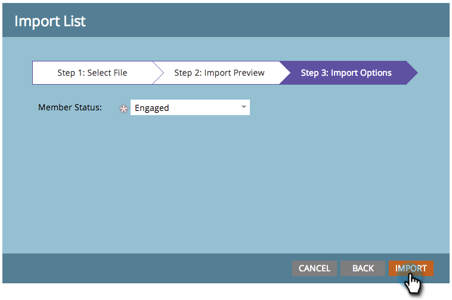

# Leden uit een werkblad importeren in een programma {#import-members-from-a-spreadsheet-into-a-program}

U kunt een lijst importeren van personen die automatisch lid worden van een programma. Dit is wat je moet doen.

## CSV-bestand {#prepare-your-csv-file} voorbereiden

1. Maak een standaard CSV-bestand in Excel, zoals in het onderstaande voorbeeld.

   

   >[!CAUTION]
   >
   >Wanneer u een datum in een datumveld importeert, gebruikt u de volgende notatie: 29-09-13 (maand/dag/jaar).

## CSV importeren in Marketo {#import-your-csv-into-marketo}

1. Ga in uw programma naar de sectie **Leden**.

   

1. Klik **Leden importeren**.

   

1. Selecteer CSV en klik **Next**.

   

1. Wijs de gegevenswaarden van de lijst aan hun overeenkomstige Gebieden van Marketo toe en klik **Volgende**.

   

   >[!NOTE]
   >
   >Als er velden zijn die u niet wilt importeren, selecteert u **IGNORE** in de vervolgkeuzelijst Marketo-veld.

1. Selecteer **Lidstatus** voor uw lijst.

   

1. Klik **Importeren**.

   

1. Wacht tot Marketo het importeren heeft voltooid en sluit vervolgens het bevestigingsvenster.

   

   Geweldig! De nieuwe leden die u hebt geïmporteerd, worden weergegeven.

   

>[!MORELIKETHIS]
>
>[Leden beheren en weergeven](/help/marketo/product-docs/core-marketo-concepts/programs/working-with-programs/manage-and-view-members.md)
