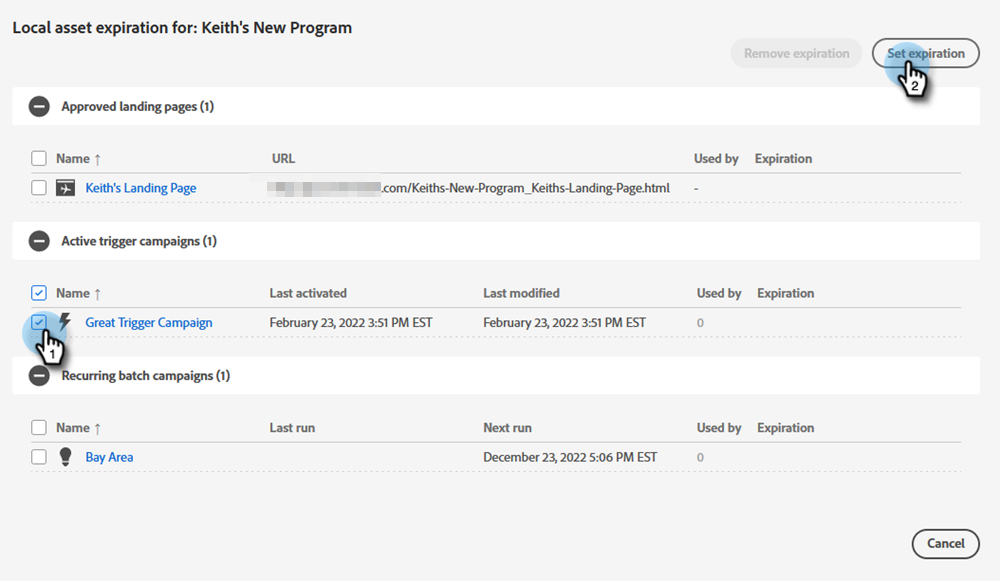

# Vervaldatum van lokale middelen {#local-asset-expiration}

Stel een vervaldatum/-tijd in om de publicatie van bestemmingspagina&#39;s ongedaan te maken, triggercampagnes te deactiveren of herhalende batchcampagnes te stoppen.

## Rechten voor verstrijken van het schema voor toewijzing van middelen {#grant-schedule-asset-expiration-permission}

Voordat u de vervaldatum van middelen kunt plannen, moet voor uw Marketo-rol de juiste machtiging zijn ingeschakeld.

>[!NOTE]
>
>**Vereiste Bevoegdheden Admin**

1. Klik in het gebied [!UICONTROL Admin] op **[!UICONTROL Users & Roles]** .

   

1. Klik op de tab **[!UICONTROL Roles]** , selecteer de gebruiker aan wie u toegang wilt verlenen en klik vervolgens op **[!UICONTROL Edit Role]** .

   

1. Selecteer [!UICONTROL Access Marketing Activities] onder **[!UICONTROL Schedule Local Asset Expiration]** en klik op **[!UICONTROL Save]** .

   

## Een vervaldatum instellen {#set-an-expiration-date}

1. Klik met de rechtermuisknop op het gewenste programma en selecteer **[!UICONTROL Set local asset expiration]** .

   

1. Controleer de elementen waarvoor u een vervaldatum wilt instellen en klik op **[!UICONTROL Set expiration]** .

   

1. Kies een vervaldatum.

   

1. Stel een tijd in. U moet een tijd minstens 15 minuten in de toekomst plannen (vergeet niet om AM/PM in te gaan). Klik op **[!UICONTROL Confirm]** als u klaar bent.

   

>[!NOTE]
>
>* Als u een bestaande vervaldatum wilt bewerken, controleert u gewoon het element of de elementen en klikt u op **[!UICONTROL Set expiration]** .
>* Nadat een element is verlopen, wordt het niet meer weergegeven op het raster Expiration. Het raster geeft alleen gepubliceerde landingspagina&#39;s, actieve triggercampagnes en terugkerende batchcampagnes weer.
>* Geplande vervaldatums worden verwijderd als het element naar een ander programma wordt verplaatst.

## Een vervaldatum verwijderen {#remove-an-expiration-date}

1. Als u een vervaldatum wilt verwijderen, controleert u de elementen en klikt u op **[!UICONTROL Remove expiration]** .

   

1. Controleer de elementen die worden beïnvloed en klik op **[!UICONTROL Confirm]** .

   

>[!NOTE]
>
>Vervaldatums die in de toekomst minder dan 15 minuten bedragen, kunnen niet worden verwijderd. Als u de vervaldatum wilt &quot;verwijderen&quot;, moet u wachten tot het element is verlopen en het vervolgens opnieuw goedkeuren of opnieuw activeren.
