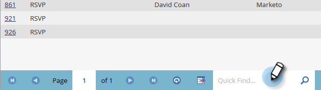

# Leden beheren en weergeven {#manage-and-view-members}

U kunt uw leden in uw programma&#39;s beheren en bekijken gebruikend het lusje van Leden.

>[!NOTE]
>
>Dive dieper in [ programmalidmaatschap ](/help/marketo/product-docs/core-marketo-concepts/programs/creating-programs/understanding-program-membership.md){target="_blank"}.

## Zoeken naar een lid {#search-for-a-member}

Onder aan de sectie Leden gebruikt u het zoekveld om te zoeken naar de leden van het programma op naam, e-mail, functie of bedrijf.

1. Klik op het tabblad **[!UICONTROL Members]** van uw programma.

   

1. Gebruik het zoekveld om de lijst met leden te doorzoeken.

   

## Het raster Leden exporteren {#export-the-members-grid}

U kunt de lijst met leden exporteren door op het pictogram [!DNL Excel] naast het zoekveld te klikken.

## Kolommen beheren in het raster Leden {#manage-columns-in-the-members-grid}

Sleep kolommen en zet ze neer om de volgorde te wijzigen. Het paar blauwe pijlen geven aan waar de kolom naartoe gaat.

Klik met de rechtermuisknop op de kolomkop om alfabetisch te sorteren, in oplopende of aflopende volgorde.

## Kies welke kolommen zichtbaar zijn in het raster {#choose-which-columns-are-visible-in-the-grid}

1. Klik op de vervolgkeuzelijst **[!UICONTROL View]** en selecteer **[!UICONTROL Create View]** .

   

1. Geef de aangepaste weergave een naam. Selecteer kolomtitels. Klik op **[!UICONTROL Add]** en **[!UICONTROL Remove]** om kolommen te verplaatsen en een weergave te maken.

   

1. Klik op **[!UICONTROL Create]**.

   

## Het raster Leden filteren  {#filter-the-members-grid}

1. Klik op de vervolgkeuzelijst **[!UICONTROL Filter]** en selecteer een progressiestappen waarop u wilt sorteren.

   

## De persoonlijke status beheren in het raster Leden {#manage-person-status-in-the-members-grid}

U kunt de status van de personen in het ledenraster wijzigen.

1. Houd **[!UICONTROL Ctrl/Cmd]** ingedrukt en selecteer de personen.

   

1. Klik op de vervolgkeuzelijst **[!UICONTROL Change Status]** en selecteer een status.

   

   Dit kan even duren. Je ziet het bericht hieronder als het allemaal klaar is.

   

Zoveel functies, maar ze zijn allemaal vrij eenvoudig. Veel plezier!

>[!MORELIKETHIS]
>
>[ creeer een Rapport van de Prestaties van het Programma ](/help/marketo/product-docs/core-marketo-concepts/programs/program-performance-report/create-a-program-performance-report.md){target="_blank"}
