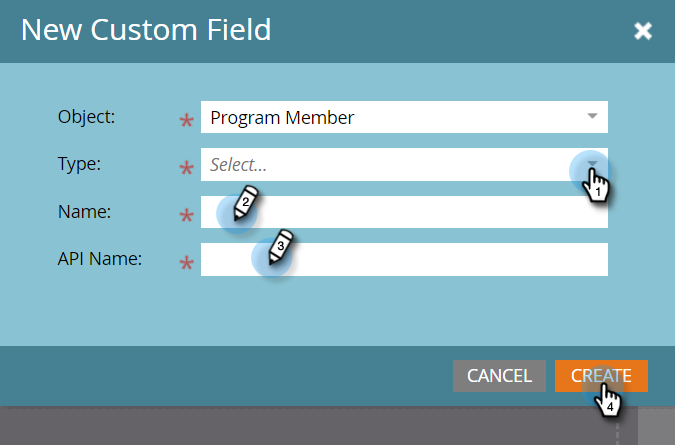

# Aangepaste velden voor programmalid {#program-member-custom-fields}

Met aangepaste velden voor programmaleden kunt u programmaspecifieke gegevens voor elk lid verzamelen. U kunt ze gebruiken in: Marketo-formulieren, slimme-lijstfilters en -triggers en slimme-campagnestroomacties. De gegevens kunnen worden weergegeven op het tabblad Leden van het programma.

## Een aangepast veld voor programmaleden maken {#create-a-program-member-custom-field}

1. Klik in Marketo op **[!UICONTROL Admin]** .

   

1. Klik op **[!UICONTROL Field Management]**.

   

1. Klik op **[!UICONTROL New Custom Field]**.

   

1. Klik op de vervolgkeuzelijst **[!UICONTROL Object]** en selecteer het gewenste object.

   

   >[!NOTE]
   >
   >[!UICONTROL Person] en [!UICONTROL Program Member] aangepaste velden kunnen niet dezelfde naam hebben.

1. Vul de overige velden in en klik op **[!UICONTROL Create]** .

   

   >[!NOTE]
   >
   >Ondersteunde typen voor aangepaste velden in [!UICONTROL Program Member] zijn: boolean, date, datetime, float, integer, string, URL. [ leer meer over gebiedstypes ](/help/marketo/product-docs/administration/field-management/custom-field-type-glossary.md){target="_blank"}.

## Objectbeschrijvingen {#object-descriptions}

| Object | Beschrijving |
|---|---|
| Bedrijf | De naam van de met de persoon verbonden onderneming. |
| Kans | Een mogelijkheid kan met een persoon of account worden geassocieerd als een potentiële toekomstige verkoop. Ze betreden Marketo meestal via een CRM of via API. |
| Persoon | Een individu in uw Marketo-database waarmee u werkt via marketingcampagnes. |
| Programmalid | Persoon die ook lid is van een programma |

## Triggers en filters {#triggers-and-filters}

U kunt hefboomwerking dit programma-specifieke gegevens in slimme lijsten via [ trekkers ](/help/marketo/product-docs/core-marketo-concepts/smart-campaigns/creating-a-smart-campaign/define-smart-list-for-smart-campaign-trigger.md){target="_blank"} en/of [ filters ](/help/marketo/product-docs/core-marketo-concepts/smart-lists-and-static-lists/creating-a-smart-list/find-and-add-filters-to-a-smart-list.md){target="_blank"}.

## Informatie over dingen {#things-to-know}

* Aangepaste velden voor programmaleden zijn alleen beschikbaar in lokale middelen. Zij worden niet gesteund in de Studio van het Ontwerp omdat er geen manier is om het aan een specifiek programma te binden.
* U kunt een formulier (of een landingspagina met een formulier) dat aangepaste velden voor programmaleden bevat, niet klonen of verplaatsen naar de Design Studio.
* [ u kunt ](/help/marketo/product-docs/core-marketo-concepts/programs/working-with-programs/program-member-custom-field-sync.md){target="_blank"} de Gebieden van de Douane van het Lid van het Programma met de Gebieden van de Douane van het Lid van de Campagne synchroniseren.
* Het programmalidobject kan maximaal 20 aangepaste velden hebben. Deze velden zijn beschikbaar voor elk programma.
* Wanneer u een lid van een programma verwijdert, als zij om het even welke gegevens op hun de douanegebied van het Lid van het Programma hebben, zullen de gegevens van dat gebied worden geschaad.
* Als u de gegevens wilt weergeven, klikt u op het tabblad Leden in het programma en maakt u een aangepaste weergave met de desbetreffende velden.
* De invoer en de uitvoer via [ lijst ](/help/marketo/getting-started/quick-wins/import-a-list-of-people.md){target="_blank"} en [ API ](https://experienceleague.adobe.com/en/docs/marketo-developer/marketo/home){target="_blank"} worden gesteund. Exporteert het werk aan de lijsten van het Lid van het Programma slechts, niet statische lijsten.
* Wanneer u twee personen samenvoegt, worden de aangepaste veldgegevens van het Lid van het Programma van de winnaar gebruikt. Maar als de winnaar er geen heeft, wordt de waarde van de verliezer gebruikt.
* Wijzigingstype is niet toegestaan in de velden Program Member Info.
* De beperking &quot;contains&quot; (Slimme lijst bevat) wordt niet ondersteund voor aangepaste velden voor programmaleden.

>[!MORELIKETHIS]
>
>* [ creeer een Gebied van de Douane in Marketo ](/help/marketo/product-docs/administration/field-management/create-a-custom-field-in-marketo.md){target="_blank"}
>
>* [ Synchronisatie van het Gebied van de Douane van het Lid van het Programma ](/help/marketo/product-docs/core-marketo-concepts/programs/working-with-programs/program-member-custom-field-sync.md){target="_blank"}
