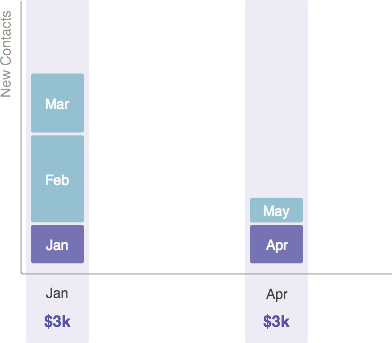

# Kosten voor tijdrekening {#understanding-period-costs}

## Overzicht {#overview}

Periode-kosten hebben betrekking op het geld dat u in een bepaalde maand aan een programma besteedt.

>[!NOTE]
>
>**Voorbeeld**
>
>Als u $1000 besteedt aan het huren van een illustrator voor een [!DNL eBook] die in juli wordt gestart, kost het [!DNL eBook] -programma in juli $1000.
>
>Als u $200 per maand aan [!DNL Google Adwords] uitgeeft - het [!DNL Google Adwords] programma zou een periodekosten van $200 _elke maand_ hebben.

>[!NOTE]
>
>[ Begrijpend Programma&#39;s ](/help/marketo/product-docs/core-marketo-concepts/programs/creating-programs/understanding-programs.md)
>
>[ Begrijpend het Lidmaatschap van het Programma ](/help/marketo/product-docs/core-marketo-concepts/programs/creating-programs/understanding-program-membership.md)

## Hoe de kosten van de periode worden berekend {#how-period-costs-are-calculated}

Stel je een gebeurtenis voor, zoals een webinar, die in maart plaatsvindt. Nieuwe mensen worden van tevoren aangeschaft uit reclame in januari en februari. Nieuwe contacten worden ook verworven na de gebeurtenis, wanneer de mensen webinar in de maanden April en Mei downloaden.

1. Met een aan maart toegerekende kostprijs voor één periode...

   

   ...de contacten die in de maanden vóór en na worden toegevoegd zullen _slechts_ tellen naar Maart.

   

1. Met aan januari, februari en maart toegerekende tijdskosten...

   

   ...contacten die pas in de maanden na maart zijn toegevoegd, zullen tot maart worden gerekend.

   

1. Met aan januari en april toegerekende tijdskosten...

   

   ...contacten die in de maanden januari tot en met maart zijn toegevoegd, zullen naar januari tellen. Contacten die in de maanden april en mei zijn toegevoegd, zullen tot april tellen.

   

   >[!NOTE]
   >
   >Samengevat: maanden zonder bepaalde periode zullen de kosten teruglopen tot de laatste die is gedefinieerd. Als er geen kosten voor de voorgaande periode zijn, worden de maanden &quot;voorwaarts&quot; doorgestuurd naar de volgende periode die is gedefinieerd. Als een periode kosten niet voor _om het even welke_ maanden is bepaald, zal het melden in RCE niet beschikbaar voor het programma zijn.

   >[!MORELIKETHIS]
   >
   >* [ Gebruikend de Kosten van de Periode in een Programma ](/help/marketo/product-docs/core-marketo-concepts/programs/working-with-programs/using-period-costs-in-a-program.md)
   >* [ filter een Rapport van het Programma door Periode Kosten ](/help/marketo/product-docs/core-marketo-concepts/programs/program-performance-report/filter-a-program-report-by-period-cost.md)
