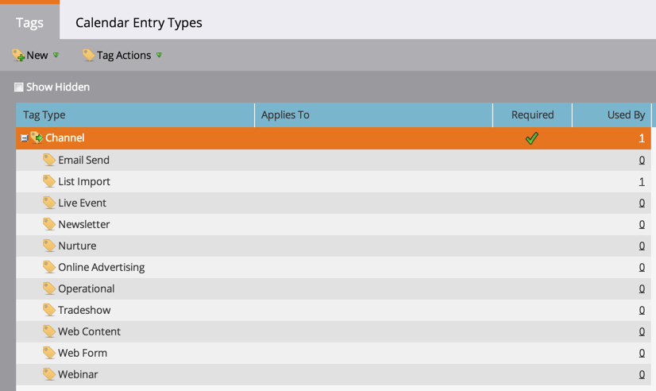

# Tags begrijpen {#understanding-tags}

Je weet waarschijnlijk dat programma&#39;s als bouwstenen in Marketo Engage zijn. Door tags en kanalen te gebruiken, kunt u gegevens filteren voor rapportagedoeleinden.

Tags worden gebruikt om programma&#39;s te beschrijven. U kunt zo veel maken als u nodig hebt, elk met unieke waarden. De kanalen identificeren het leveringsmechanisme in een programma, zoals webinar, sponsoring, of online advertentie.

## Type code {#tag-type}

Tagtypen geven het soort informatie aan waarop u wilt sorteren.

>[!TIP]
>
>Bespreek aan uw Admin van Marketo als u [ douanetags ](/help/marketo/product-docs/administration/tags/create-custom-tags.md){target="_blank"} zou willen creëren.

>[!NOTE]
>
>**Voorbeeld**
>
>* [!UICONTROL Tag Type] = Program Owner

## Tagwaarde {#tag-value}

Elk labeltype heeft waarden waaruit u kunt kiezen.

>[!NOTE]
>
>**Voorbeeld**
>
>* Tagwaarden = Anna, Arun, Reza

## Kanaal {#channel}

De kanalen worden gebruikt om op te melden hoe uw [ leden ](/help/marketo/product-docs/core-marketo-concepts/programs/creating-programs/understanding-program-membership.md){target="_blank"} door uw programma worden bewogen. Elk kanaal heeft een reeks progressiestatus en één status die aan gelijk succes wordt geplaatst.

>[!NOTE]
>
>**Voorbeeld**
>
>* Kanaal = Roadshow
>* Progressiestatus = Uitgenodigd, Geregistreerd, Bijgewoond, Geen Show
>* Succes = bijgewoond

>[!MORELIKETHIS]
>
>* [ creeer de Markeringen van de Douane ](/help/marketo/product-docs/administration/tags/create-custom-tags.md){target="_blank"}
>* [ creeer een Kanaal van het Programma ](/help/marketo/product-docs/administration/tags/create-a-program-channel.md){target="_blank"}
