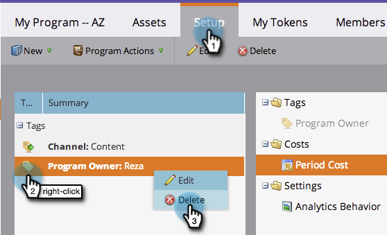

# Tags gebruiken in een programma {#use-tags-in-a-program}

Tags zijn kenmerken die uw programma&#39;s beschrijven en die worden gebruikt om programmatypen te groeperen in de rapportage.

>[!NOTE]
>
>Als u de Ontdekkingsreiziger van de Cyclus van Ontvangsten gebruikt, moet een periodekosten (zelfs als het 0 is) worden bepaald opdat de rapportering voor het programma beschikbaar is.

## Een tag in een programma gebruiken {#use-a-tag-in-a-program}

1. Selecteer uw programma. Klik op **[!UICONTROL Setup]**.

   

1. Sleep een tag naar het canvas.

   

1. Selecteer een waarde in de keuzelijst.

   

1. Klik op **[!UICONTROL Save]**.

   

1. Rechts. De nieuwe tag wordt weergegeven op het canvas.

   

## Een tag bewerken {#edit-a-tag}

1. Ga naar de tab **[!UICONTROL Setup]** . Klik met de rechtermuisknop op de tag. Selecteer **[!UICONTROL Edit]**.

   

1. Klik op de vervolgkeuzelijst. Selecteer een nieuwe waarde.

   

1. Klik op **[!UICONTROL Save]**.

   

1. Geweldig! De bewerkingen worden weerspiegeld in het canvas.

   

## Een tag verwijderen  {#delete-a-tag}

1. Ga naar de tab **[!UICONTROL Setup]** . Klik met de rechtermuisknop op de tag en selecteer **[!UICONTROL Delete]** .

   

1. Klik op **[!UICONTROL Delete]** om te bevestigen.

   

Mooi werk! Programma&#39;s met consistente labels maken het veel gemakkelijker als u rapporten uitvoert.
