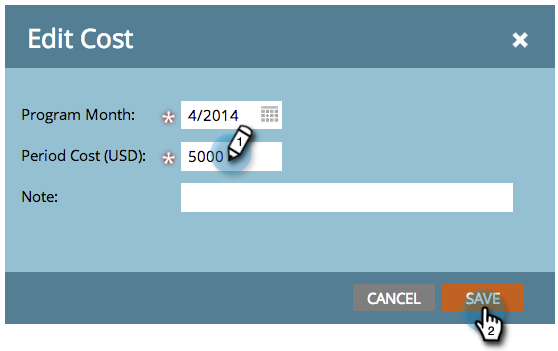
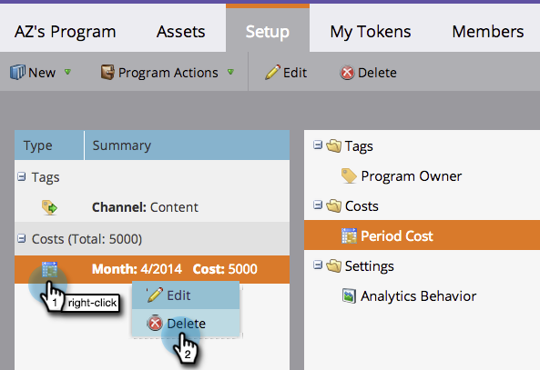

# Periode-kosten in een programma gebruiken {#using-period-costs-in-a-program}

Een [periode kost](understanding-period-costs.md) is het bedrag dat u aan een programma besteedt. Het kan één of meerdere maanden zijn en wordt gebruikt voor het melden van ROI.

>[!NOTE]
>
>**Diep duiken**
>
> Meer informatie over de analyse van de [inkomstencyclus](http://docs.marketo.com/display/docs/revenue+cycle+analytics).

## Kosten voor een periode toevoegen  {#add-a-period-cost}

1. Ga naar het tabblad **Setup** van uw programma.

   

1. Sleep **Periode-kosten** naar het canvas.

   

1. Klik op het kalenderpictogram. Selecteer een maand. Klik op **OK**.

   

1. Voer een **Periode-kosten** in (zonder decimalen of komma&#39;s). Klik op **Opslaan**.

   >[!NOTE]
   >
   >Dit kan een schatting zijn. U kunt de kosten van een periode altijd bewerken zodra u het exacte bedrag kent (zie de volgende sectie).

   

1. De kosten worden weergegeven in het programma.

   

   >[!TIP]
   >
   >U kunt meerdere periodekosten naar het canvas slepen. Hiermee kunt u meerdere maanden met verschillende tijdskosten aan uw programma toewijzen.

## Periode-kosten bewerken {#edit-a-period-cost}

1. Als u meer of minder geld uitgeeft dan oorspronkelijk gepland, kunt u de periodekosten uitgeven.
1. Ga naar het **Opstelling **lusje van uw programma.

   

1. Klik met de rechtermuisknop op de kosten voor de **periode**. Selecteer **Bewerken**.

   

1. Breng de gewenste wijzigingen aan. Klik op **Opslaan**.

   

## Periode-kosten verwijderen {#delete-a-period-cost}

1. Ga naar het tabblad **Setup** van uw programma.

   

1. Klik met de rechtermuisknop op de kosten voor de **periode**. Selecteer **Verwijderen**.

   

1. Klik op **Verwijderen **om te bevestigen.

   

>[!MORELIKETHIS]
>
>* [Kosten voor tijdrekening](understanding-period-costs.md)
>* [Analyse van inkomstencyclus](http://docs.marketo.com/display/docs/revenue+cycle+analytics)
>* [Een programmarapport filteren op kosten van periode](../../../../product-docs/core-marketo-concepts/programs/program-performance-report/filter-a-program-report-by-period-cost.md)

>

