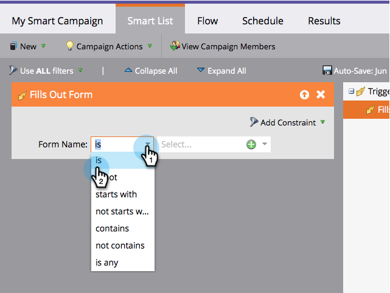

# Slimme lijst definiëren voor slimme campagne | Trigger {#define-smart-list-for-smart-campaign-trigger}

Maak een slimme campagne die op één persoon tegelijkertijd wordt uitgevoerd die op levende gebeurtenissen wordt gebaseerd door trekkers toe te voegen.

1. Klik in uw slimme campagne op de knop **Slimme lijst** tab.

   

1. Zoek de trigger en sleep de trigger naar het canvas.

   

   >[!NOTE]
   >
   >Een slimme campagne met triggers wordt uitgevoerd in **Trigger** in. Deze wordt op één persoon tegelijk uitgevoerd op basis van gebeurtenissen die worden geactiveerd en eventuele aanvullende filters.

   >[!IMPORTANT]
   >
   >Wanneer u een Booleaans veld in een slimme lijst van een triggercampagne gebruikt, moet u deze expliciet instellen op &#39;false&#39; om het veld tijdens de uitvoering van de campagne correct te laten evalueren.

1. Klik op de vervolgkeuzelijst en kies een operator.

   

   >[!CAUTION]
   >
   >Rode kronkelige lijnen geven fouten of ontbrekende informatie aan. Als de campagne niet wordt gecorrigeerd, is deze ongeldig en wordt deze niet uitgevoerd.

   >[!TIP]
   >
   >In een slimme campagne met zowel triggers als filters gaan de triggers bovenaan en wanneer ze worden geactiveerd, doorlopen alleen mensen die aan de filtercriteria voldoen de stroom.

1. Definieer de trigger.

   

   >[!NOTE]
   >
   >Bij meerdere triggers gaat een persoon door de flow als **ALLE** een van de triggers wordt geactiveerd.

Leer hoe u de campagne op een aantal mensen tegelijk kunt uitvoeren [Slimme lijst definiëren voor slimme campagne | Batch](/help/marketo/product-docs/core-marketo-concepts/smart-campaigns/creating-a-smart-campaign/define-smart-list-for-smart-campaign-batch.md).

>[!MORELIKETHIS]
>
>[Een stroomstap toevoegen aan een slimme campagne](/help/marketo/product-docs/core-marketo-concepts/smart-campaigns/flow-actions/add-a-flow-step-to-a-smart-campaign.md)
