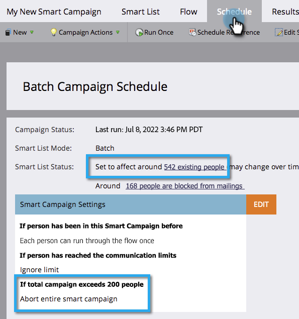

# Controlelijst voor slimme campagne {#smart-campaign-checklist}

Voer de onderstaande stappen uit om ervoor te zorgen dat de slimme campagne probleemloos wordt uitgevoerd en fouten zoveel mogelijk te voorkomen.

## ID van slimme lijstfouten ophalen {#get-rid-of-smart-list-errors}

Klik in de slimme campagne op **[!UICONTROL Smart List]** . Verwijder alle rode kronkelige lijnen die je ziet door de fouten op te lossen.

>[!TIP]
>
>Rode kronkelige lijnen geven fouten of ontbrekende informatie aan. Als de campagne niet wordt gecorrigeerd, is deze ongeldig en wordt deze niet uitgevoerd.
>
>Houd de zaken ook eenvoudig. Als je tientallen of honderden filters hebt, is het moeilijk om ze te onderhouden en bij te houden. Minder filters zijn ook sneller te laden.

>[!NOTE]
>
>Het gebruik van **[!UICONTROL Member of Smart List]** kan fouten bevatten in die andere lijst. Kijk daar ook.

## Rid van stroomfouten ophalen {#get-rid-of-flow-errors}

Klik in de slimme campagne op **[!UICONTROL Flow]** . Verwijder alle rode kronkelige lijnen die je ziet door de fouten te corrigeren.

>[!TIP]
>
>Houd de muisaanwijzer boven de rode kronkellijn om details van de fout weer te geven.

## Het tabblad Planning bekijken {#review-the-schedule-tab}

Controleer op het tabblad **[!UICONTROL Schedule]** **[!UICONTROL Smart List Status]** op fouten in de slimme campagne die moeten worden gecorrigeerd.

## Limiet personenbeperkingen controleren {#check-person-restrictions-limit}

Controleer in het tabblad **[!UICONTROL Schedule]** of het aantal gekwalificeerde personen de beperking voor personen niet overschrijdt.

>[!TIP]
>
>Indien vereist, kunt u [ persoonbeperkingen in een Slimme Campagne ](/help/marketo/product-docs/core-marketo-concepts/smart-campaigns/using-smart-campaigns/override-person-restrictions-in-a-smart-campaign.md) met voeten treden.

>[!NOTE]
>
>**Herinnering**
>
>Als uw Slimme Campagne nog ontbreekt, leer hoe te [ berichten ](/help/marketo/product-docs/core-marketo-concepts/miscellaneous/understanding-notifications.md) begrijpen om te weten wat verkeerd ging en hoe te om het te bevestigen.

Geweldig werk! Houd deze controlelijst bij de hand voordat u een slimme campagne uitvoert.
