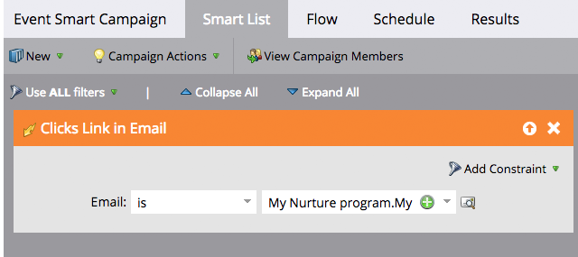

# Slimme campagnes in batch en trigger {#understanding-batch-and-trigger-smart-campaigns}

Er zijn twee soorten slimme campagnes: Batch en Trigger.

## Slimme batchcampagne {#batch-smart-campaign}

>[!NOTE]
>
>**Definitie**
>
>Een batchcampagne wordt op een bepaald moment gestart en heeft invloed op een specifieke groep mensen in één keer. Een voorbeeld zou een e-mail naar alle mensen in Californië verzenden.

Slimme batchcampagnes hebben alleen filters in de sectie van de slimme lijst (dus geen triggers).

Klik op de knop **Schema** bevestigt dat de slimme campagne is ingesteld op &quot;Batch&quot;.

**Slimme batch-campagnes**

* Kan worden gepland voor terugkerende acties, zoals dagelijks, wekelijks, en maandelijks. Je kunt ze ook één keer laten draaien.
* zijn zichtbaar op de [programmaoverzicht](/help/marketo/product-docs/core-marketo-concepts/programs/program-schedule-view/navigating-the-program-schedule-view.md). Alles na een stap &quot;Wacht&quot; in de slimme campagne wordt niet in de weergave opgenomen.

  

## Slimme campagne activeren {#trigger-smart-campaign}

>[!NOTE]
>
>**Definitie**
>
>Een triggerslimme campagne beïnvloedt één persoon tegelijk op basis van een getriggerde gebeurtenis. Een voorbeeld van een trigger is het klikken op een koppeling in een e-mailbericht.

Als een slimme campagne minstens één trigger in de sectie van de slimme lijst gebruikt, wordt de modus automatisch ingesteld op geactiveerd.

Klik op de knop **Schema** wordt bevestigd dat de slimme campagne is ingesteld op &quot;Trigered&quot;.

**Slimme campagnes activeren**

* Kan niet worden gepland voor herhalingen. Deze kunnen alleen op actief of inactief worden ingesteld.
* U kunt meerdere trigger instellen. Als er echter een trigger wordt geactiveerd, worden de campagneacties uitgevoerd.

>[!TIP]
>
>Gebruik de [activiteitenlogboek](/help/marketo/product-docs/core-marketo-concepts/smart-lists-and-static-lists/managing-people-in-smart-lists/locate-the-activity-log-for-a-person.md) om te zien wat stap voor stap in uw slimme campagnes is gebeurd. U kunt het activiteitenlogboek in het laatste lusje van de detailpagina van een persoon vinden.
