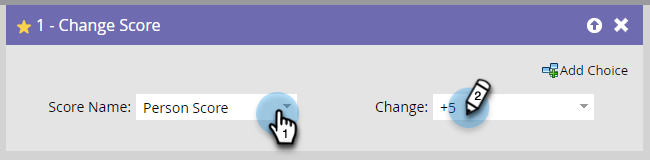

# Een stroomstap toevoegen aan een slimme campagne {#add-a-flow-step-to-a-smart-campaign}

De stappen van de stroom vertellen Marketo wat u met een groep mensen wilt gebeuren die kwalificeren. Dit zijn uw instructies en de slimme campagne doet uw bod!

1. Ga naar **Marketingactiviteiten**.

   

1. Selecteer uw slimme campagne en klik op **Stroom**.

   

1. Typ om te zoeken naar een flowstap en sleep deze naar het canvas. U kunt meerdere stroomstappen toevoegen. Herhaal dit bij elke stap die u wilt uitvoeren.

   

1. Klik op de gewenste optie en waarde.

   

>[!NOTE]
>
>De stappen van de stroom worden uitgevoerd in de orde waarin zij worden vermeld.  [De stroomstappen opnieuw ordenen](/help/marketo/product-docs/core-marketo-concepts/smart-campaigns/flow-actions/add-a-flow-step-to-a-smart-campaign/reorder-the-flow-steps-in-a-smart-campaign.md) om ervoor te zorgen dat ze in de juiste volgorde zitten.

>[!TIP]
>
>Een rode kronkellijn verschijnt in het geval van een ongeldige ingang. Houd de muisaanwijzer boven de lijn om te zien hoe u deze kunt corrigeren.

Geweldig! Zorg ervoor dat u [de slimme campagne controleren en valideren](/help/marketo/product-docs/core-marketo-concepts/smart-campaigns/creating-a-smart-campaign/smart-campaign-checklist.md) voordat u het programma plant of activeert.

>[!MORELIKETHIS]
>
>* [Keuze toevoegen in een stroomstap gebruiken](/help/marketo/product-docs/core-marketo-concepts/smart-campaigns/flow-actions/use-add-choice-in-a-flow-step.md)
>* [De Stappen van de Stroom in een Slimme Campagne opnieuw ordenen](/help/marketo/product-docs/core-marketo-concepts/smart-campaigns/flow-actions/add-a-flow-step-to-a-smart-campaign/reorder-the-flow-steps-in-a-smart-campaign.md)
