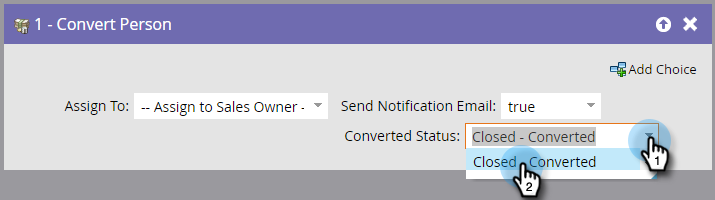

# Persoon omzetten {#convert-person}

>[!NOTE]
>
>Alleen beschikbaar bij integratie met [!DNL Salesforce].

## Overzicht {#overview}

Gebruik deze stroomstap om een persoon om te zetten in een contactpersoon [!DNL Salesforce]. U kunt besluiten wie om het contact aan toe te wijzen, een bericht naar de eigenaar te verzenden, en een omgezette status te plaatsen.

## Gebruik {#usage}

1. Selecteer aan wie u de resulterende contactpersoon, account en opportuniteit wilt toewijzen.

   

   >[!CAUTION]
   >
   >Als u een persoon in Marketo converteert, krijgt u een nieuwe account en krijgt u de kans om [!DNL Salesforce]. Als u geen dubbele rekeningen wilt, gebruik [!DNL Salesforce] om te zetten.

1. Kies of u een **[!UICONTROL notification]** naar de eigenaar worden gestuurd of niet.

   

1. Selecteer de **[!UICONTROL converted status]**.

   

En daar ga je!
