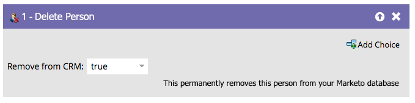

# Persoon verwijderen {#delete-person}

Soms komen onjuiste mensen in uw database terecht. De stap Person-flow verwijderen kan deze verwijderen.

>[!CAUTION]
>
>Wanneer u een persoon verwijdert, worden ook alle historische RCE-gegevens verwijderd. Het kan niet ongedaan worden gemaakt.

1. Wanneer u in de stroomstap sleept, zal het automatisch worden geplaatst om van uw CRM eveneens te schrappen.

   

1. U kunt bijvoorbeeld verwijderen uit Marketo Engage en niet uit uw CRM:

   

>[!NOTE]
>
>Het verwijderen van de persoon uit uw CRM _werkt alleen met[!DNL Salesforce]_ . Als u een persoon uit Marketo verwijdert en ervoor kiest deze in [!DNL Salesforce] te houden, worden ze opnieuw gemaakt in Marketo als de [!DNL Salesforce] -record ooit wordt bijgewerkt.
