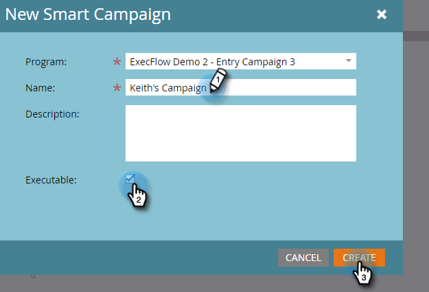
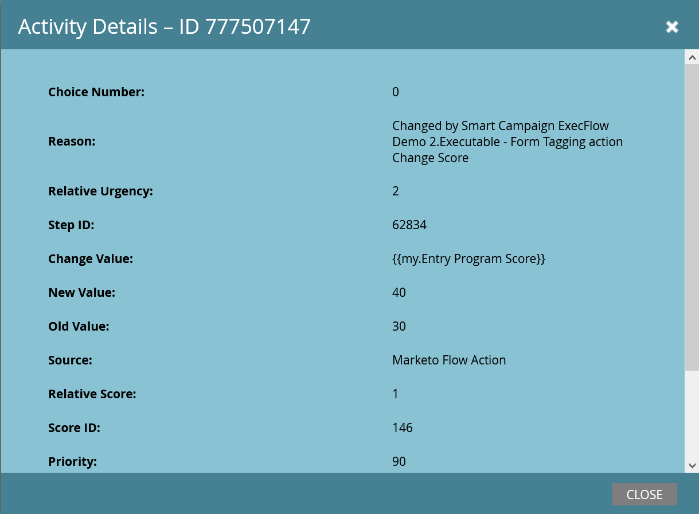

# Campagne uitvoeren {#execute-campaign}

Een uitvoerbare Campagne, zoals andere campagnes, bevat een Slimme Lijst, Stroom, en Programma. In tegenstelling tot andere campagnes, plant of activeert u het eigenlijk niet. Het kan slechts door een andere campagne via de Uitvoeren de debietstap van de Campagne worden geroepen. De stroomstappen in de Uitvoerbare Campagne worden in serie in werking gesteld met de oudercampagne (in tegenstelling tot de Campagne van het Verzoek, die parallel in een afzonderlijke Campagne van de Trekker loopt).

>[!NOTE]
>
>Uitvoerbare Campagnes zijn altijd kinderen van de (ouder) campagne die hen roept.

## Wanneer gebruikt u Campagne uitvoeren {#when-to-use-execute-campaign}

Er zijn veel dingen die je kunt doen met een uitvoerbare campagne. Zij worden ontworpen om gemeenschappelijke operationele taken, zoals lood het verpletteren, levenscyclusbeheer, en het scoring (onder anderen) te vergemakkelijken, en kunnen worden gebruikt om het zelfde werkschema van binnen Partij of teweeggebrachte Campagnes uit te voeren.

U kunt ze ook gebruiken wanneer u een aparte flow moet uitvoeren, maar u moet afhangen van de resultaten van die flow in de volgende keuzemogelijkheden voor de stap Stroom (als dit het geval is, moet u dat doen).

Uitvoeren Campagne is een verbetering op [ Campagne van het Verzoek ](/help/marketo/product-docs/core-marketo-concepts/smart-campaigns/flow-actions/request-campaign.md), aangezien het in-series kan lopen, terwijl laatstgenoemde slechts parallel loopt.

>[!NOTE]
>
>De Stappen en Webhooks van de wachttijd zullen nooit compatibel met Uitvoerbare Campagnes zijn. Voor die, zult u de Campagne van het Verzoek in plaats daarvan moeten gebruiken.

## Een uitvoerbare campagne maken {#how-to-create-an-executable-campaign}

1. Klik met de rechtermuisknop op het gewenste programma en selecteer **[!UICONTROL New Smart Campaign]** .

   

1. Geef deze een naam, selecteer het selectievakje **[!UICONTROL Executable]** en klik op **[!UICONTROL Create]** .

   

1. Definieer de slimme lijst en stroom, net als elke andere slimme campagne.

U kunt ook een bestaande slimme campagne klonen. Als u een bestaande uitvoerbare campagne kloont, moet u het selectievakje **[!UICONTROL Executable]** na de naam nog steeds inschakelen.

>[!NOTE]
>
>U kunt geen campagne klonen die triggers bevat.

## De context van het token voor bovenliggende campagne gebruiken {#use-parent-campaign-token-context}

Wanneer ingesteld op true, worden de volgende token-contexten verzonden naar de onderliggende campagne (de campagne die wordt uitgevoerd):

* Mijn tokens
* Campagne Tokens
* Programmatokens
* Member Tokens
* [ de Tokens van de Trekker ](/help/marketo/product-docs/marketo-sales-insight/msi-for-salesforce/features/tabs-in-the-msi-panel/interesting-moments/trigger-tokens-for-interesting-moments.md) (als geroepen van een Gerichte Campagne)

**API Interactie**

Wanneer het gebruiken van Programma of de Campagne van het Verzoek [ in API ](https://experienceleague.adobe.com/nl/docs/marketo-developer/marketo/rest/assets/smart-campaigns#batch), zowel laat u waarden voor Mijn Tokens overgaan, die de waarden met voeten treedt die voor die tokens in de campagne worden geplaatst u roept. Als die Campagne dan een andere campagne uitvoert en &quot;de Context van de Ouder van het Gebruik aan Waar plaatst,&quot;zal het de waarden gebruiken die door API worden overgegaan, eerder dan de waarden die in de toepassing worden geplaatst.

## Notities {#things-to-note}

* De slimme lijst zal uit iedereen filteren die niet kwalificeert. Als een persoon in aanmerking komt, worden de resulterende uitgevoerde activiteitenverslagen van de Campagne vermeld als &quot;Gekwalificeerd: WAAR&quot; (en FALSE als zij niet)
* De kwalificatieregels van de Campagne van het programma zijn van toepassing (de Slimme Montages van de Campagne onder het lusje van het Programma)
* Uitvoerbare campagnes kunnen niet worden aangeroepen in verschillende werkruimten
* Als u [ gebruikt verwijder uit Stroom ](/help/marketo/product-docs/core-marketo-concepts/smart-campaigns/flow-actions/remove-from-flow.md) stroomactie gericht op een Uitvoerbare Campagne, zal het zowel het kind als de ouder richten
* Gebruikend uit symbolische overerving - bijvoorbeeld, als u één enkele gemeenschappelijke het scoren stroom hebt die door veelvoudige verschillende activa teweeggebracht, kunt u een gebrek Mijn Symbolische score in de kindcampagne en in de oudercampagne bepalen zodat u de waarde van de kindscore campagnecampagne voor uw oudercampagnes (zie hieronder voor visueel voorbeeld) kunt met voeten treden
* Uitvoerbare campagnes kunnen tot drie niveaus diep worden opgeroepen (bijvoorbeeld Bovenliggende campagne > Onderliggend element > Onderliggend element > Onderliggend element)

>[!CAUTION]
>
>Verlaat nooit uw slimme lijsten voor Uitvoerbare Campagnes ongeldig, anders _zal niemand_ voor het kwalificeren. De beste praktijken moeten afzonderlijke slimme lijstactiva tot stand brengen, hen volledig bepalen, en ervoor zorgen zij geldig zijn. Dan, gebruik het &quot;Lid van Slimme filter van de Lijst&quot;in de Uitvoerbare Campagne zodat kunt u uw slimme lijstdefinitie ruilen.

## Voorbeeld van overerving van token {#token-inheritance-example}

Hieronder ziet u een visueel voorbeeld van Overerving token in één uitvoerbare campagne en twee bovenliggende campagnes: een met een tokencontext ingesteld op **[!UICONTROL True]** en een met **[!UICONTROL False]** .

Onderliggende campagne met een verkapte Change Score.

De onderliggende campagne is Mijn Tokens.

### Voorbeeld één - waar {#example-one-true}

In de Uitvoeren de stroomstap van de Campagne van de eerste oudercampagne, &quot;[!UICONTROL Use Parent Campaign Token Context]&quot;wordt geplaatst aan **[!UICONTROL True]**.

De bovenliggende campagne is My Tokens.

De resultaten: de score is met +10 gewijzigd.

### Voorbeeld twee: Onwaar {#example-two-false}

In de Uitvoeren de stroomstap van de Campagne van de tweede oudercampagne, wordt de &quot;TokenContext van de Campagne van het Gebruik van de Ouder&quot;geplaatst aan **Vals**.

De bovenliggende campagne is My Tokens.

De resultaten: de score blijft ongewijzigd, omdat de score van de onderliggende campagne, +0, is gebruikt.

