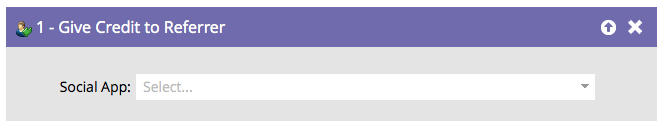

# Crediteren aan referentie {#give-credit-to-referrer}

## Overzicht {#overview}

Wanneer u een [verwijzingsaanbod](/help/marketo/product-docs/demand-generation/social/referral-offers/create-a-referral-offer.md) of [zweten](/help/marketo/product-docs/demand-generation/social/sweepstakes/create-sweepstakes.md), kunt u de referentie op verschillende manieren crediteren:

* Doorverwezen bezoeken
* Aanwijzingen
* **Smart List Trigger**
* Aangepaste JavaScript-gebeurtenis

Als u ervoor kiest om de **Smart List Trigger** als u een doel wilt opgeven, moet u de optie **Crediteren aan referentie** stap Stroom.

## Gebruik {#usage}

1. Als u eenmaal uw campagne hebt gemaakt en hebt besloten op welke actie u wilt starten, zoekt en selecteert u gewoon de sociale app die u de referentie wilt toekennen.

   

   >[!NOTE]
   >
   >Controleer of uw sociale app is geconfigureerd voor gebruik van Smart List Trigger. Zie  [Doel voor doorverwijzing opgeven](/help/marketo/product-docs/demand-generation/social/referral-offers/specify-goal-for-referral-offer.md) voor meer informatie.

Uitstekend! Elke persoon die met deze stap wordt verwerkt, zal nu zijn referentie crediteren.
