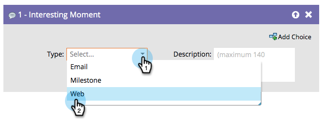

# Interessant moment {#interesting-moment}

Als u de Verkoop Insight van Marketo hebt, kunt u **het Interesten Moment** debietstap gebruiken om uw verkoopteam zicht in de koele dingen te geven uw mensen doen.

1. Selecteer het interessante moment **[!UICONTROL type]** dat u wilt gebruiken.

   

1. Maak een **[!UICONTROL description]** die het interessante moment aan uw verkoopteam uitlegt.

   

   >[!TIP]
   >
   >_minder is meer_. Werk samen met uw verkoopteam om ervoor te zorgen dat interessante momenten eigenlijk interessant zijn.

U kunt [ tokens in interessante momenten ](/help/marketo/product-docs/marketo-sales-insight/msi-for-salesforce/features/tabs-in-the-msi-panel/interesting-moments/trigger-tokens-for-interesting-moments.md){target="_blank"} ook gebruiken om werkelijk nuttige dynamische beschrijvingen te maken.

>[!MORELIKETHIS]
>
>* [ Gebruikend Interesserende Momenten ](/help/marketo/product-docs/marketo-sales-insight/msi-for-salesforce/features/tabs-in-the-msi-panel/interesting-moments/using-interesting-moments.md){target="_blank"}
>* [ Tokens voor het Interesten Momenten ](/help/marketo/product-docs/marketo-sales-insight/msi-for-salesforce/features/tabs-in-the-msi-panel/interesting-moments/trigger-tokens-for-interesting-moments.md){target="_blank"}
