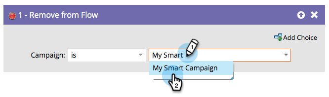

# Verwijderen uit stroom {#remove-from-flow}

Stel dat u een slimme campagnestroom hebt die &quot;Send Alert&quot;gebruikt om een verkoopvertegenwoordiger eraan te herinneren om een heet vooruitzicht te roepen. Het verzendt één bericht elke dag tot rep de vraag maakt. U zou &quot;verwijderen uit Stroom&quot;in een trekkercampagne kunnen gebruiken zodra het vooruitzicht is gecontacteerd om verdere alarm tegen te houden. Het is als een slimme projectorstoel voor een persoon.

>[!NOTE]
>
>Dit zou normaal gesproken gevolgen hebben voor mensen die in een campagnestap zitten.

1. Zoek en selecteer de slimme campagne waaruit u personen wilt verwijderen.

   

>[!NOTE]
>
>U kunt een specifieke slimme campagne kiezen of &quot;deze campagne&quot; kiezen in de vervolgkeuzelijst **[!UICONTROL Campaign]** om de campagne te selecteren waarin u zich fysiek bevindt.

>[!NOTE]
>
>Deze functionaliteit is bedoeld om binnen de stroomstappen van een Slimme Campagne worden gebruikt.
