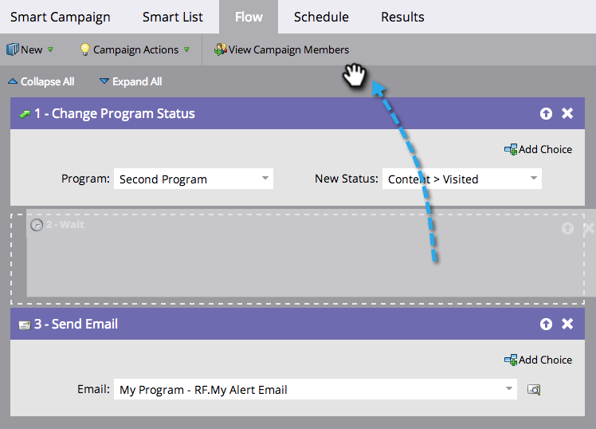

# De Stappen van de Stroom in een Slimme Campagne opnieuw ordenen {#reorder-the-flow-steps-in-a-smart-campaign}

De stroomstappen worden van boven naar beneden uitgevoerd. Hieronder wordt beschreven hoe u de stroomstappen opnieuw kunt rangschikken op basis van uw wensen.

>[!PREREQUISITES]
>
>[Een stroomstap toevoegen aan een slimme campagne](/help/marketo/product-docs/core-marketo-concepts/smart-campaigns/flow-actions/add-a-flow-step-to-a-smart-campaign.md)

1. Sleep in het tabblad Stroom van de slimme campagne de stap Stroom naar de gewenste positie.

>[!NOTE]
>
>De stroomstappen worden uitgevoerd in de volgorde waarin ze in de flow worden weergegeven.

Sommige dingen zijn simpel. Sleep n&#39; drop away!
