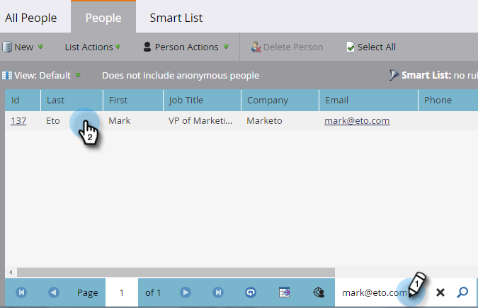

# Campagne aanvragen {#request-campaign}

U kunt mensen in een specifieke campagne plaatsen met de &quot;[!UICONTROL Request Campaign]&quot; enkele stap in de flow.

>[!NOTE]
>
>De campagne die u plaatst moet actief zijn en de [Campagne is aangevraagd](/help/marketo/product-docs/core-marketo-concepts/smart-campaigns/using-smart-campaigns/setting-up-a-trigger-smart-campaign-for-sales-using-campaign-is-requested.md){target="_blank"} trigger.

1. In de **[!UICONTROL Database]**, zoekt en selecteert u de gewenste persoon/personen.

   

1. Klikken **[!UICONTROL Person Actions]**, aanwijzen **[!UICONTROL Special]** en selecteert u **[!UICONTROL Request Campaign]**.

   

1. Selecteer de campagne waarin u de persoon wilt plaatsen en klik op **[!UICONTROL Run Now]**.

   

1. Rechtsboven in het scherm ziet u wanneer het klaar is. Klik op **[!UICONTROL View Results]**.

   

   Uw persoon is nu in de gevraagde campagne.

   

   Geweldig werk!

>[!TIP]
>
>Gebruik de &quot;[!UICONTROL Campaign is Requested]&quot; activeer of filter om te zoeken naar personen die door deze flowstap worden beïnvloed.
