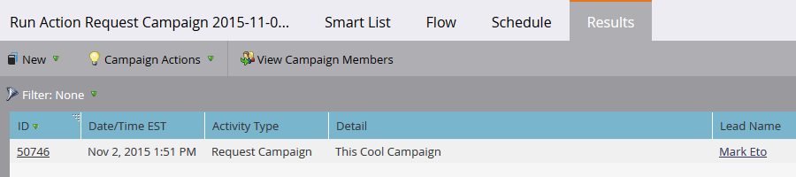

# Campagne aanvragen {#request-campaign}

U kunt mensen in een specifieke campagne plaatsen door &quot;[!UICONTROL Request Campaign]&quot;enige debietstap te gebruiken.

>[!NOTE]
>
>De campagne u de persoon in plaatst moet actief zijn en de [ Campagne hebben wordt Gevraagde ](/help/marketo/product-docs/core-marketo-concepts/smart-campaigns/using-smart-campaigns/setting-up-a-trigger-smart-campaign-for-sales-using-campaign-is-requested.md){target="_blank"} trekker.

1. Zoek en selecteer de gewenste persoon of personen in de **[!UICONTROL Database]** .

   

1. Klik op **[!UICONTROL Person Actions]** , houd de cursor boven **[!UICONTROL Special]** en selecteer **[!UICONTROL Request Campaign]** .

   

1. Selecteer de campagne waarin u de persoon wilt plaatsen en klik op **[!UICONTROL Run Now]** .

   

1. Rechtsboven in het scherm ziet u wanneer het klaar is. Klik op **[!UICONTROL View Results]**.

   

   Uw persoon is nu in de gevraagde campagne.

   

   Geweldig werk!

>[!TIP]
>
>Gebruik &quot;[!UICONTROL Campaign is Requested]&quot;trekker of filter om mensen te vinden die door deze stroomstap worden beïnvloed.
