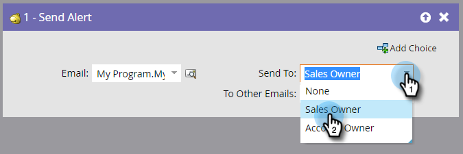

# Waarschuwing verzenden {#send-alert}

Marketo Engage kan een e-mailbericht met persoonlijke gegevens naar iedereen sturen - de eigenaar van de verkoop, een partner of iemand anders. Gebruik de stap &quot;[!UICONTROL Send Alert]&quot;-stroom.

1. Zoek en selecteer het e-mailbericht dat u wilt verzenden.

   

   >[!NOTE]
   >
   >Uw e-mailwaarschuwing moet alle koptekstgegevens bevatten en de status **[!UICONTROL Approved]** hebben.

1. U kunt op het voorvertoningspictogram klikken om te controleren of u het juiste e-mailadres hebt geselecteerd.

   

   >[!NOTE]
   >
   >Gebruik de token &quot;[!UICONTROL Send Alert Info]&quot; in uw e-mail.

1. Selecteer de ontvanger van de waarschuwing. U kunt [!UICONTROL Sales Owner] of [!UICONTROL Account Owner] kiezen.

   

1. Voeg desgewenst andere e-mailadressen toe (gescheiden door een komma of een puntkomma).

   

   >[!TIP]
   >
   >In triggercampagnes kunt u tokens gebruiken in **[!UICONTROL To Other Emails]** zoals `{{lead.Territory Owner}}` of `{{my.Alert Recipient}}` als de waarden geldige e-mailadressen zijn. Tokens in **[!UICONTROL To Other Emails]** werken niet in een batchcampagne.

>[!MORELIKETHIS]
>
>[ creeer een E-mail ](/help/marketo/product-docs/email-marketing/general/creating-an-email/create-an-email.md){target="_blank"}
