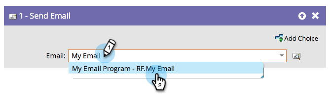

# E-mail verzenden {#send-email}

De stap &quot;[!UICONTROL Send Email]&quot;-stroom kan worden gebruikt als onderdeel van campagnes of als één stap in de workflow om e-mails naar uw mensen te verzenden.

U kunt een voorvertoning van de geselecteerde e-mail weergeven in de stap Stroom.

1. Zoek en selecteer het e-mailbericht dat u wilt verzenden.

   

   >[!NOTE]
   >
   >Uw e-mail moet worden goedgekeurd als u het in de stroomstap wilt selecteren.

1. Klik op het voorvertoningspictogram om het momenteel geselecteerde e-mailbericht weer te geven.

   

Er wordt een nieuw tabblad/venster geopend waarin u het e-mailbericht kunt zien.
