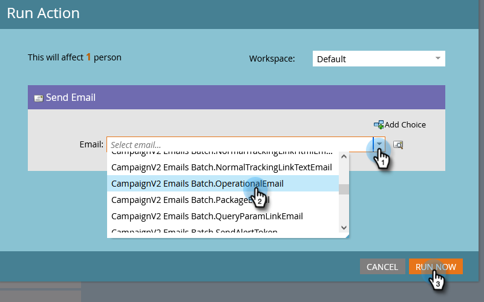

# Single Flow-handelingen van persoonlijke detailpagina {#single-flow-actions-from-person-detail-page}

Naast het uitvoeren van enige stroomacties van binnen een Slimme Lijst, kunt u hen ook direct op een pagina van het Detail van de Persoon in werking stellen.

1. Klik **Database**.

   

1. Zoek de gewenste persoon.

   

1. Klik op de vervolgkeuzelijst **Handelingen personen** en selecteer de gewenste stap voor de stroom. In dit voorbeeld gebruiken we [E-mail verzenden](/help/marketo/product-docs/core-marketo-concepts/smart-campaigns/flow-actions/send-email.md).

   

1. Selecteer de gewenste e-mail en klik **Nu uitvoeren**.

   

>[!NOTE]
>
>Als u rechtstreeks naar een pagina met persoonlijke gegevens navigeert (bijvoorbeeld via koppeling) in plaats van uit een pagina/element te komen dat aan een werkruimte is gekoppeld, moet u een werkruimte kiezen in stap 4.
