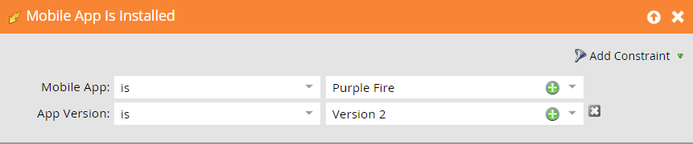

# Triggers en filters voor mobiele slimme campagnes {#triggers-and-filters-for-mobile-smart-campaigns}

U kunt triggers en filters instellen voor een slimme campagne voor een mobiele app.

Voor de meeste activiteiten zijn er een trigger, een filter en een inactiviteitsfilter. Gebruik inactiviteitsfilters om een handeling bij te houden, zoals tikken op een pushmelding, die *niet* gebeuren.

* Mobiele app is/is geïnstalleerd
* Mobiele app is/is geopend
* Heeft/heeft mobiele toepassingsactiviteiten
* Heeft/heeft een mobiele App-sessie
* Taps/Tapping Mobile Push Notification

Er zijn alleen filters voor deze activiteit:

* Er is pushmelding verzonden - filter en inactiviteitsfilter

Zoeken naar **mobiele app** in het rechterdeelvenster om alle triggers en filters voor de Mobile App weer te geven.

## Restricties {#constraints}

Gebruik beperkingen met triggers en filters om de gegevens verder te sorteren.

Alle triggers en filters, met uitzondering van het bericht Is pushbericht verzonden, bevatten de volgende twee standaardbeperkingen:

* Apparaattype - iPod, iPhone, iPhone 6 Plus, iPad mini, iPad, Android-smartphone, Android-tablet, onbekend (dit is een lijst met voorinstellingen)

* Platform - iPhone of Android

Sommige triggers en filters bieden aanvullende beperkingen, zoals:

* Toepassingsversie - Een manier om mensen aan te wijzen die zich niet in de nieuwste versie bevinden. Als de nieuwste versie van de app 2.0 is, kunt u deze bijvoorbeeld gebruiken om te zoeken naar personen die NIET aanwezig zijn in App versie 2.0

* Bron installeren - Momenteel is de enige optie API

* Landinstelling - De instelling op het apparaat

* Mobiele toepassing - De naam van specifieke app. Nuttig om op te geven of u meer dan één

* Versie van Platform - De versie van het besturingssysteem

* Sessieduur (seconden) - Sessietijd wanneer de app op de voorgrond staat

* Is gedrukt - **Waar** betekent dat pushmeldingen kunnen worden verzonden. **Onwaar** betekent dat ze dat niet kunnen; de persoon heeft er bijvoorbeeld mogelijk voor gekozen geen pushberichten meer te ontvangen

## Triggers en filters {#triggers-and-filters}

**Heeft mobiele toepassing**

Gebruik dit filter om te zien wie uw app ooit heeft geïnstalleerd. Deze optie is alleen beschikbaar als filter.

>[!NOTE]
>
>Het filter vindt zowel de huidige als de vorige installatie, omdat Marketo het verwijderen van apps niet bijhoudt.

**Restricties** - Apparaattype, Platform, mobiele toepassing, mobiele toepassingsversie, apparaattype, bron installeren, is pushingeschakeld en Landinstelling

>[!TIP]
>
>Het wordt aanbevolen Bevat mobiele app = true en Is Push Enabled = true op te geven en de naam van uw mobiele app op te geven bij het definiëren van de slimme lijst met personen die een pushmelding moeten ontvangen.

Mobiele app is/is geïnstalleerd

* Mobiele toepassing is geïnstalleerd - trigger

* Mobiele toepassing geïnstalleerd - filter

* NOT Mobile App geïnstalleerd - inactiviteitsfilter

**Restricties** - Apparaattype, Platform, App-versie, landinstelling en bron installeren

Mobiele app is/is geopend

* Mobiele app is geopend - trigger

* Mobiele app geopend - filter

* NOT Mobile App geopend - inactiviteitsfilter

**Restricties** - Type apparaat en Platform

Heeft/heeft mobiele toepassingsactiviteiten

Deze vormen een krachtige manier om aangepaste mobiele activiteiten te volgen. U moet met uw ontwikkelaar samenwerken om het volgen van de opstelling [voor Android](https://developers.marketo.com/documentation/mobile/installation-instructions-on-android) en [voor iOS](https://developers.marketo.com/documentation/mobile/installation-instructions-on-ios).

* Heeft mobiele toepassingsactiviteit - trigger

* Toepassingsactiviteiten op mobiele apparaten hadden - filter

* Geen mobiele toepassingsactiviteit - inactiviteitsfilter

**Restricties** - Apparaattype, Platform, Mobiele toepassingsversie, Landinstelling, Versie van Platform plus vijf extra:

* Actie - Aangepaste mobiele activiteiten

* Type handeling - (optioneel) Tekstveld dat wordt gebruikt om meerdere handelingen te categoriseren

* Details van handeling - (optioneel) Tekstveld met aanvullende informatie over een handeling

* Metrisch - (optioneel) numeriek veld dat aanvullende informatie over een handeling bevat (bijvoorbeeld prijs)

* De Lengte van de actie (seconden) - (facultatieve) Numeriek gebied dat kan worden gebruikt om te vangen hoe lang het een gebruiker duurde om een actie te voltooien

Met de actievereisten kunt u de trigger en filters gebruiken om mobiele activiteiten zeer nauwkeurig bij te houden.

>[!NOTE]
>
>**Voorbeeld**
>
>Onder het actietype *Winkelen* Hier is een zeer specifieke actie, met andere beperkingen die het bepalen:
>
>* Een shirt kopen
   >   * Het was rood
   >   * Dat kost $30
   >   * Het kostte 20 seconden om te kopen

Zo ziet het filter er in Marketo uit:

>[!NOTE]
>
>**Voorbeeld**
>
>U kunt meerdere handelingen uitvoeren onder hetzelfde actietype. Je normale boodschappenervaring kan verschillende kolommen bevatten bij Winkelen. En wat sokken om mee te gaan?
>
>| Type handeling | Winkelen | Winkelen |
>|---|---|---|
>| Handeling | Gekochte hemd | Gekochte broeken |
>| Details van handeling | Kleur | Kleur |
>| Metrisch handeling | Prijs | Prijs |

**Heeft/heeft een mobiele App-sessie**

* Heeft Mobile App-sessie - trigger

* App-sessie hebben gehad - filter

* Geen mobiele App-sessie - inactiviteitsfilter

**Restricties** - Apparaattype, Platform en Sessieduur (seconden)

Taps/Tapping Push Notification

* Taps Push Notification - trigger

* Melding van pushbericht met aanraakopties - filter

* Melding van niet-getapte pushmelding - inactiviteitsfilter

**Restricties** - Apparaattype, Platform, mobiele toepassingsversie, pushmelding en Platform-versie

>[!TIP]
>
>Gebruik het filter Inactiviteit van pushmelding niet aangeraakt om te zoeken naar mensen die niet hebben getikt op een pushmelding die onlangs naar hen is verzonden, zodat u deze via e-mail kunt volgen.

**Er is een pushmelding verzonden** Deze activiteit is alleen beschikbaar als filter.

* Er is pushmelding verzonden, filter

* Geen pushmelding verzonden - inactiviteitsfilter

**Restricties** - Push Notification en Mobile App

>[!MORELIKETHIS]
>
>* [Een restrictie toevoegen aan een slim lijstfilter](/help/marketo/product-docs/core-marketo-concepts/smart-lists-and-static-lists/using-smart-lists/add-a-constraint-to-a-smart-list-filter.md)
>* [Inactiviteitsfilters gebruiken in een slimme lijst](/help/marketo/product-docs/core-marketo-concepts/smart-lists-and-static-lists/using-smart-lists/use-inactivity-filters-in-a-smart-list.md)

