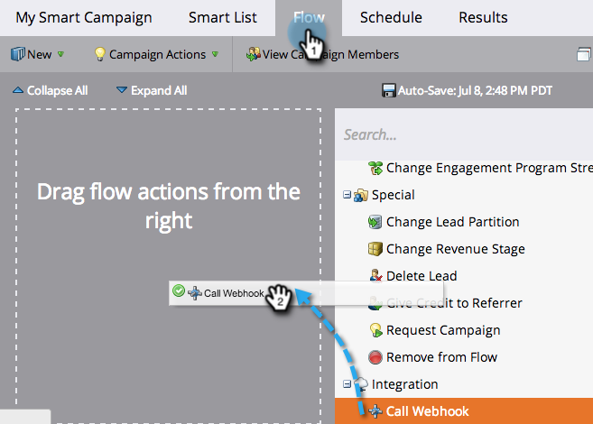

# Een webhaak gebruiken in een slimme campagne {#use-a-webhook-in-a-smart-campaign}

Om a [&#x200B; webhaak &#x200B;](https://experienceleague.adobe.com/nl/docs/marketo-developer/marketo/webhooks/webhooks){target="_blank"} te gebruiken, voeg het aan a [&#x200B; Slimme Campagne &#x200B;](/help/marketo/product-docs/core-marketo-concepts/smart-campaigns/flow-actions/add-a-flow-step-to-a-smart-campaign.md){target="_blank"} als stroomactie toe.

>[!AVAILABILITY]
>
>Niet alle Marketo Engage-gebruikers hebben deze functionaliteit aangeschaft. Neem contact op met het Adobe-accountteam (uw accountmanager) voor meer informatie.

1. [&#x200B; creeer een Slimme Campagne &#x200B;](/help/marketo/product-docs/core-marketo-concepts/smart-campaigns/creating-a-smart-campaign/create-a-new-smart-campaign.md){target="_blank"}.

   >[!NOTE]
   >
   >Webhaken kunnen alleen worden gebruikt in triggercampagnes.

1. Ga naar de tab **[!UICONTROL Flow]** en sleep in de handeling **[!UICONTROL Call Webhook]** flow.

   

1. Selecteer de **[!UICONTROL Webhook]** .

   

1. U kunt ook Webhooks gebruiken in een slimme lijst.

   

1. Tot slot kunt u Webhooks in **[!UICONTROL Add Choice]** in een stroomstap gebruiken.

   
