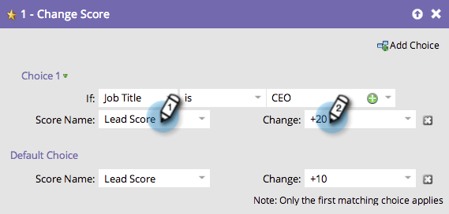

# Keuze toevoegen in een stroomstap gebruiken {#use-add-choice-in-a-flow-step}

>[!PREREQUISITES]
>
>[ voeg een Stap van de Stroom aan een Slimme Campagne toe ](/help/marketo/product-docs/core-marketo-concepts/smart-campaigns/flow-actions/add-a-flow-step-to-a-smart-campaign.md){target="_blank"}

Met de optie Keuze toevoegen kunt u een stap-stap gebruiken en zeggen dat dit afhankelijk is wanneer u de details kiest.

1. Voeg onder het tabblad **[!UICONTROL Flow]** van de slimme campagne een eventuele flowstap toe en klik op **[!UICONTROL Add Choice]** .

   

1. Selecteer de keuzevoorwaarde.

   

1. Kies de keuzerondje en voer een keuzevrijheid in. Hiermee stelt u uw criteria of keuze in.

   

1. Voer een waarde in voor de stroomstap voor de keuze.

   

   >[!CAUTION]
   >
   >Tokens zullen __ niet in het voorwaardendeel van een keuzestap werken.

1. Herhaal bovenstaande stappen om meerdere opties toe te voegen en voeg vervolgens de standaardwaarde toe of pas deze aan.

   

   >[!TIP]
   >
   >U kunt om het even welk van uw stroomstappen plaatsen aan —doe niets—, in welk geval geen actie op die keus zal worden genomen.

   >[!CAUTION]
   >
   >Alleen de eerste passende keuze wordt toegepast op de stap Stroom. Leer hoe te om [ opnieuw te rangschikken &quot;Keus&quot;in een stroomactie ](/help/marketo/product-docs/core-marketo-concepts/smart-campaigns/flow-actions/reorder-add-choice-in-a-flow-step.md){target="_blank"} toevoegt.

   Geweldig! U kunt nu één slimme campagne maken met keuzemogelijkheden voor de stap Snel in plaats van meerdere slimme campagnes voor elke keuze te maken.

   >[!MORELIKETHIS]
   >
   >[ reorder Add Keuze in een Stap van de Stroom ](/help/marketo/product-docs/core-marketo-concepts/smart-campaigns/flow-actions/reorder-add-choice-in-a-flow-step.md){target="_blank"}
