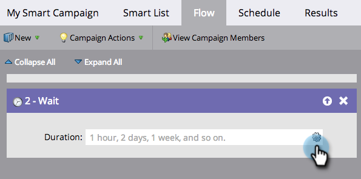
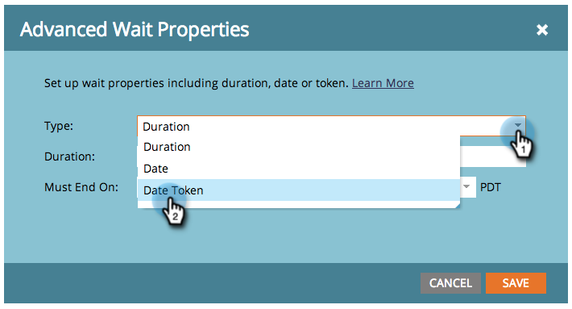

# Een Date Token gebruiken in een Wachten Flow-stap {#use-a-date-token-in-a-wait-flow-step}

U kunt de stap van de Wachtstroom gebruiken om de reis van een persoon door een Slimme Campagne tot een bepaalde datum te pauzeren die een datumteken gebruikt. U kunt de einddatum ook met een aantal dagen wijzigen.

>[!NOTE]
>
>Dit geldt alleen voor triggercampagnes. U kunt deze functie niet gebruiken in Batch-campagnes.

1. Sleep over de stap **[!UICONTROL Flow]** flow in de tab Slimme campagne **[!UICONTROL Wait]** .

   

1. Klik op het tandwielpictogram.

   

1. Selecteer **[!UICONTROL Type]** in de vervolgkeuzelijst **[!UICONTROL Date Token]** .

   

1. Kies een [!UICONTROL Date token] om op te geven wanneer de wachtstap moet worden beëindigd:

   * `{{my._____}}`
   * `{{lead.______}}`
   * `{{company.______}}`
   * `{{system._______}}`

   

1. Als u wilt wachten tot de volgende verjaardag van de datum die in het huidige of volgende kalenderjaar voorkomt, schakelt u het selectievakje in.

   

   >[!TIP]
   >
   >Gebruik deze optie op datumtokens die naar datums in het verleden verwijzen, zoals een geboortedatum of begindatum van een contract.

1. U kunt desgewenst de einddatum met een opgegeven aantal dagen wijzigen.

   

   >[!NOTE]
   >
   >U kunt ook het aantal dagen opgeven met een token `{{lead.` of `{{company.` dat een veld met gehele getallen of een token van het type getal vertegenwoordigt. `{{my.`

1. Klik op **[!UICONTROL Save]**.

   

   >[!MORELIKETHIS]
   >
   >* [ Gebruik een Duur in een Wacht Stap van de Stroom ](/help/marketo/product-docs/core-marketo-concepts/smart-campaigns/flow-actions/wait/use-a-duration-in-a-wait-flow-step.md){target="_blank"}
   >* [ gebruik een Specifieke Datum in een Wacht Stap van de Stroom ](/help/marketo/product-docs/core-marketo-concepts/smart-campaigns/flow-actions/wait/use-a-specific-date-in-a-wait-flow-step.md){target="_blank"}
