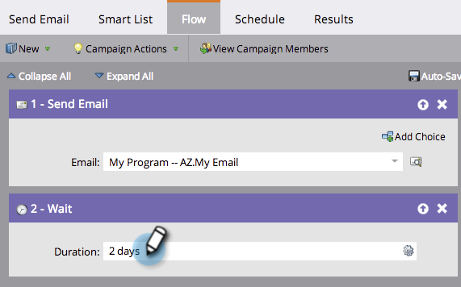

# Gebruik een Duur in een Stap van de Stroom van de Wacht {#use-a-duration-in-a-wait-flow-step}

U kunt de stap van de Wachtrij gebruiken om de reis van een persoon door een slimme campagne voor een bepaalde duur te pauzeren. U kunt ook criteria opgeven voor de dag van de week en het tijdstip waarop deze eindigt.

1. In uw slimme campagne **Stroom** tab, sleep over de **Wachten** stap Stroom.

   

1. Voer in hoelang u wilt pauzeren.

   

1. Dat is het! De flow wordt onderbroken voor de opgegeven duur. Voor geavanceerde opties klikt u op het tandwielpictogram rechts.

   

1. Geef de dag van de week op waarop de wachttijdstap moet worden beëindigd.

   

1. Geef eventueel de tijd op. Klikken **Opslaan**.

   

   >[!NOTE]
   >
   >**Voorbeeld**
   >
   >Op vrijdag om 17.00 uur start iemand een slimme campagne. De wachttijdstap is gevorderd: 48 uur en moet om 9.00 uur eindigen op maandag-vrijdag.
   >
   >Het resultaat zou zijn dat de persoon in de stroom zou blijven **Maandag, 9.00 uur**. Dit is de eerste M-F-datum na 48 uur.

   >[!NOTE]
   >
   >De duur, de data, de tijden, en de gebruikte dagen zijn allen gebaseerd op de tijdzone van uw abonnement.

   >[!MORELIKETHIS]
   >
   >* [Gebruik een specifieke Datum in een Stap van de Stroom van de Wacht](/help/marketo/product-docs/core-marketo-concepts/smart-campaigns/flow-actions/wait/use-a-specific-date-in-a-wait-flow-step.md)
   >* [Een Date Token gebruiken in een Wachten Flow-stap](/help/marketo/product-docs/core-marketo-concepts/smart-campaigns/flow-actions/wait/use-a-date-token-in-a-wait-flow-step.md)

