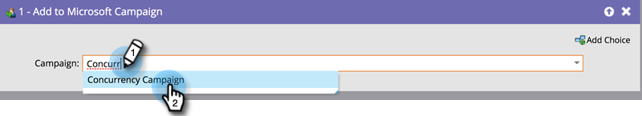

# Personen toevoegen aan of verwijderen uit uw [!DNL Dynamics] -campagne {#add-or-remove-people-from-your-dynamics-campaign}

## Toevoegen aan dynamicampagne {#add-to-dynamics-campaign}

Deze stroomstap kan in de Slimme Campagnes van Marketo Engage worden gebruikt om mensen als lood of contacten in een campagne van Microsoft toe te voegen. Als de lead nog niet bestaat in Dynamics, wordt deze automatisch gesynchroniseerd en toegevoegd aan de campagne.

>[!NOTE]
>
>Deze flowactie is alleen beschikbaar voor triggercampagnes.

Zoek en selecteer in uw slimme campagne de campagne Dynamiek waaraan u uw mensen wilt toevoegen.

>[!NOTE]
>
>Als u geen campagne van de Dynamiek in de campagnemijst kunt zien:
>
>* Zorg ervoor dat de campagnecSync functioneel is
>* De campagne is niet actief in [!DNL Microsoft Dynamics]

Het systeem leidt automatisch tot een campagne-specifieke statische marketing Lijst, elk voor lood en contacten, om de persoon aan toe te voegen. Het is een eenmalige actie en eens voor verdere syncs aan de campagne, wordt de zelfde Lijst van de Marketing gebruikt. De naamgevingsstandaard die wordt gebruikt voor de naam van de statische marketinglijst, is `Mkto-leads-<uniqueID>` voor leads en `Mkto-contacts-<uniqueID>` voor contactpersonen.

Het koppelen van deze door Marketo gegenereerde marketinglijsten aan andere campagnes kan leiden tot verwarrend gedrag. Bijvoorbeeld: het toevoegen aan één campagne zou er ook toe leiden dat de tweede campagne wordt uitgebreid. Ook het loskoppelen van de door Marketo gegenereerde marketinglijst van de campagne in [!DNL Dynamics] wordt afgeraden.

## Verwijderen uit dynamicampagne {#remove-from-dynamics-campaign}

Deze flowstap kan worden gebruikt in Marketo Smart Campaigns om mensen uit een Microsoft-campagne te verwijderen. Hierdoor worden alleen die leads uit een campagne verwijderd die eerder aan de campagne zijn toegevoegd via de flowactie &quot;Toegevoegd aan Microsoft-campagne&quot;.

>[!NOTE]
>
>Deze flowactie is alleen beschikbaar voor triggercampagnes.

Zoek en selecteer in uw slimme campagne de campagne Dynamica waaruit u uw personen wilt verwijderen.

>[!NOTE]
>
>Als er geen [!DNL Dynamics] campagne wordt weergegeven in de lijst met campagnes:
>
>* Zorg ervoor dat de campagnecSync functioneel is
>* De campagne is niet actief in [!DNL Microsoft Dynamics]
