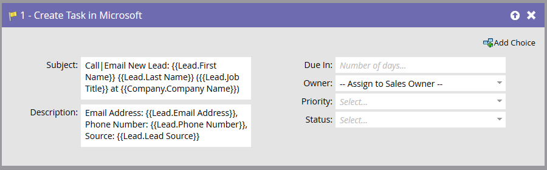

# Taak maken in Microsoft {#create-task-in-microsoft}

Als markator, hebt u informatie die verkoop in het sluiten van overeenkomsten kan helpen. U kunt taken maken om ze te laten weten wat ze moeten doen en wanneer ze het moeten doen.

Met Taak maken in Microsoft wordt een taak gemaakt onder Activiteiten die betrekking hebben op de persoon (lead of contactpersoon) in [!DNL Microsoft] .

>[!NOTE]
>
>Deze stroomstap zal _slechts werken wanneer gebruikt met trekkers_, niet filters, in uw slimme campagne.

Standaard ziet de flowstap er als volgt uit:

>[!NOTE]
>
>Wanneer de Marketo Sync-gebruiker taken maakt, is **[!UICONTROL Due In]** een vereist veld voor de taak die moet worden gemaakt in [!DNL Microsoft] . Marketo voert standaard vijf dagen in als er geen waarde wordt opgegeven.

Pas alle velden aan om de taak op de gewenste manier te maken.

>[!NOTE]
>
>Het veld &quot;Status&quot; dat voor de taak is opgegeven in de Flow Action werkt het veld &quot;Reden van status&quot; bij in [!DNL Microsoft] .

>[!TIP]
>
>U kunt `{{lead.tokens}}` , `{{company.tokens}}` , `{{campaign.tokens}}` en `{{system.tokens}}` in de **[!UICONTROL Subject]** en **[!UICONTROL Description]** gebruiken. Zie [&#x200B; Tokens voor de Stappen van de Stroom &#x200B;](/help/marketo/product-docs/core-marketo-concepts/smart-campaigns/flow-actions/use-tokens-in-flow-steps.md){target="_blank"} voor meer details.
