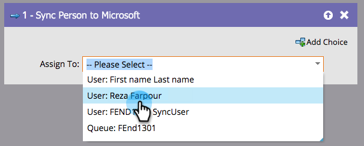

# Persoon synchroniseren naar Microsoft {#sync-person-to-microsoft}

Deze functie is alleen bedoeld voor diegenen die Marketo Engage integreren met [!DNL Microsoft Dynamics].

## Overzicht {#overview}

Deze stroomstap zal Marketo-gecreeerde mensen in uw Dynamica CRM opnemen.

## Gebruik {#usage}

U kunt een gebruiker van de Dynamiek als persoonseigenaar plaatsen.

>[!NOTE]
>
>Wanneer u de optie &quot;[!UICONTROL Sync Person to Microsoft]&quot;De stroomactie (in een Campagne van de Trekker slechts), leidt/het contact zal in real time in Dynamiek worden gecreeerd.
