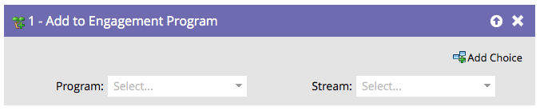

# Toevoegen aan betrokkenheidsprogramma {#add-to-engagement-program}

De Slimme Campagne die u met deze stroomstap bouwt zal de gateway aan uw betrokkenheidsprogramma zijn.

1. Selecteer het betrokkenheidsprogramma waaraan u de personen wilt toevoegen.

   

1. Selecteer de stream waarin u de personen wilt plaatsen.

   

   >[!NOTE]
   >
   >U kunt geen persoon aan veelvoudige stromen binnen het zelfde programma toevoegen.
