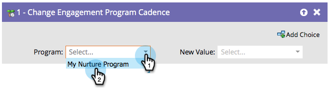

# Cadre van het Programma van de Aanwezigheid van de Verandering {#change-engagement-program-cadence}

Als een persoon wordt verzorgd door een betrokkenheidsprogramma, kunt u tijdelijk de verpleegkunde voor deze persoon pauzeren door deze flowstap te gebruiken.

>[!NOTE]
>
>Als een persoon geen lid van het programma is en door deze stroomstap loopt, zullen zij automatisch als lid en in uw eerste stroom worden toegevoegd.

## Gebruik {#usage}

1. Selecteer het betrokkenheidsprogramma.

   

1. Selecteren **[!UICONTROL Paused]** als de **[!UICONTROL New Value]** om te voorkomen dat de persoon inhoud ontvangt.

   

U kunt de persoon instellen op **[!UICONTROL Normal]** als u wilt dat ze opnieuw inhoud ontvangen.
