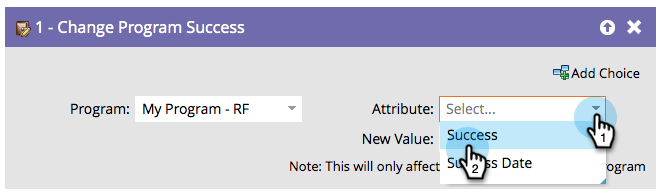

# Programma is gewijzigd {#change-program-success}

Als u ooit een groep mensen hebt die verkeerd met het Succes van het Programma worden gemerkt, kunt u deze stroomstap gebruiken om succes aan waar of vals te plaatsen.

1. Wanneer u in deze flowstap sleept, wordt het programma automatisch ingesteld op het programma dat de slimme campagne bevat die u bewerkt.

   >[!NOTE]
   >
   >Alleen de leden van het programma worden hierdoor beïnvloed.

   

1. Selecteer **[!UICONTROL Success]** of **[!UICONTROL Success Date]** als het kenmerk.

   

   >[!NOTE]
   >
   >Als u [!UICONTROL Success Date] op iets instelt, wordt Succes automatisch ingesteld op true. Als u [!UICONTROL Success] instelt op true, wordt de datum van successie automatisch ingesteld op de huidige datum.

1. Stel de **[!UICONTROL New Value]** in op **[!UICONTROL True]** of **[!UICONTROL False]** .

   

   >[!TIP]
   >
   >U kunt de flowstap tweemaal gebruiken om zowel de markering Succes als de datum in te stellen.

Geweldig! Nu weet je hoe je het ongedaan kunt maken en succes kunt forceren.
