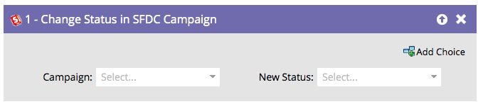

# Status wijzigen in SFDC-campagne {#change-status-in-sfdc-campaign}

Met deze flowstap kunt u de status van leads voor het lid van de Salesforce-campagne wijzigen.

>[!NOTE]
>
>Alleen beschikbaar bij integratie met Salesforce.

Als een leiding niet bestaat in Salesforce of nog geen lid is van de campagne, wordt deze automatisch gesynchroniseerd en met de juiste status toegevoegd aan de Salesforce-campagne.

1. Zoek eerst de Salesforce **[!UICONTROL Campaign]** in en selecteer deze.

   

1. Selecteer vervolgens de **[!UICONTROL New Status]** die u wilt instellen en u bent klaar!

   
