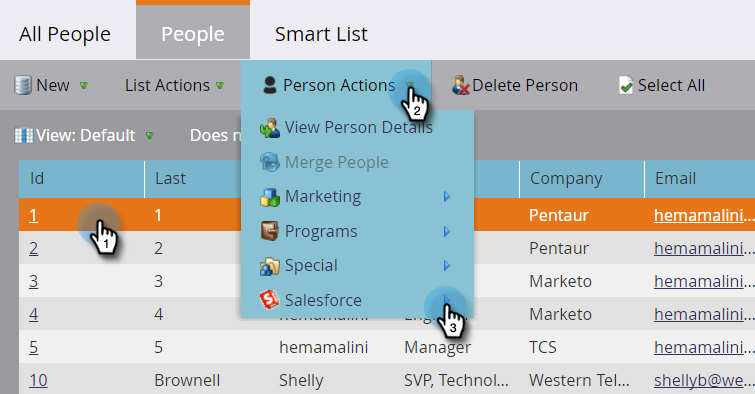

# Persoon verwijderen uit SFDC {#delete-person-from-sfdc}

Als u een specifieke reeks lood uit Salesforce moet verwijderen maar hen als mensen in Marketo Engage verlaat, kunt u de Persoon van de Schrapping van SFDC stroomactie gebruiken.

>[!NOTE]
>
>Alleen beschikbaar bij integratie met Salesforce.

1. Klik in de database op de persoon die u uit Salesforce wilt verwijderen. Klik vervolgens op **[!UICONTROL Person Actions]** en selecteert u **[!DNL Salesforce]**.

   

1. Selecteren **[!UICONTROL Delete Person from SFDC]**.

   

1. Zorg ervoor dat de **[!UICONTROL Delete in Marketo]** instellen is **[!UICONTROL false]** en klik vervolgens op **[!UICONTROL Run Now]**.

   

   Na de looppas van de stroomstap, zal uw persoon niet meer een lood in Salesforce zijn maar zal in Marketo blijven.

   >[!CAUTION]
   >
   >Als u **[!UICONTROL Delete in Marketo]** tot **[!UICONTROL true]** en de mensen uit Marketo en de leiders van Salesforce verwijderen, ze zijn voorgoed verdwenen. Dit kan niet ongedaan worden gemaakt.
