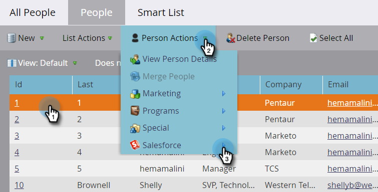

# Persoon uit SFDC verwijderen {#delete-person-from-sfdc}

Als u een specifieke reeks leads uit Salesforce moet verwijderen maar deze als personen in Marketo Engage wilt behouden, kunt u de actie Person verwijderen uit SFDC-flow gebruiken.

>[!NOTE]
>
>Alleen beschikbaar bij integratie met [!DNL Salesforce] .

1. Klik in de database op de persoon die u uit Salesforce wilt verwijderen. Klik vervolgens op **[!UICONTROL Person Actions]** en selecteer **[!DNL Salesforce]** .

   

1. Selecteer **[!UICONTROL Delete Person from SFDC]**.

   

1. Zorg dat de instelling **[!UICONTROL Delete in Marketo]** **[!UICONTROL false]** is en klik vervolgens op **[!UICONTROL Run Now]** .

   

   Na de uitvoering van de stap voor de doorloop is uw persoon geen lead meer in [!DNL Salesforce] maar blijft deze in Marketo.

   >[!CAUTION]
   >
   >Als u **[!UICONTROL Delete in Marketo]** instelt op **[!UICONTROL true]** en de mensen uit Marketo en de leads uit Salesforce verwijdert, zijn ze voor altijd verdwenen. Dit kan niet ongedaan worden gemaakt.
