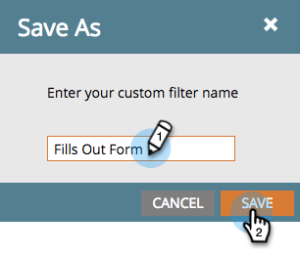

# Resultaten van slimme campagnes filteren {#filter-smart-campaign-results}

>[!PREREQUISITES]
>
>[Resultaten slimme campagne weergeven](/help/marketo/product-docs/core-marketo-concepts/smart-campaigns/smart-campaign-data/view-smart-campaign-results.md)

Filter slimme campagneresultaten om specifieke activiteiten te zien die voor u van belang zijn.

## Filteren op opgeslagen filters {#filter-by-saved-filters}

1. In uw slimme campagne **Resultaten** tabblad, klikt u op **Filter** en selecteer een opgeslagen filter.

   

   >[!NOTE]
   >
   >Standaard zijn er geen filters toegepast en tonen de resultaten alle activiteiten.

## Een aangepast filter maken {#create-a-custom-filter}

1. Klikken op **Filter** en vervolgens **Aangepast**.

   

1. Selecteer de activiteitstypen die u wilt zien en klik op **Opslaan als** .

   

   >[!TIP]
   >
   >Klikken op **Toepassen** om rechtstreeks een aangepast filter op de resultaten toe te passen zonder het op te slaan.

1. Voer een filternaam in en klik op **Opslaan**.

   

1. Het aangepaste filter wordt toegepast op de resultaten en is nu beschikbaar in de vervolgkeuzelijst (u moet de pagina mogelijk vernieuwen om deze weer te geven in de vervolgkeuzelijst.)

   

   Is dat niet cool? Uw aangepaste filter is nu beschikbaar voor gebruik in alle activiteitenlogboeken.
