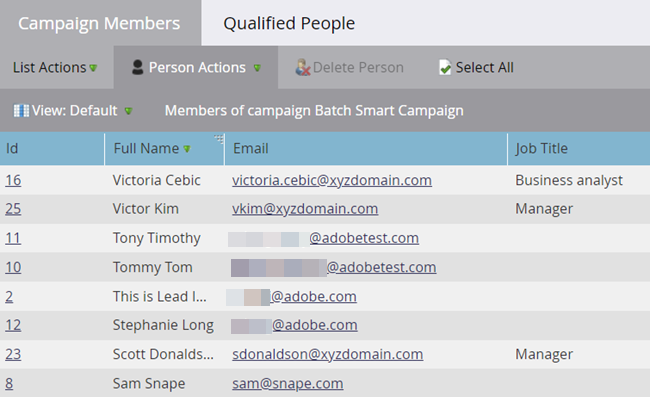

# Leden van slimme campagnes weergeven {#view-smart-campaign-members}

Personen weergeven die al door de slimme-campagnestroom zijn gelopen.

1. Ga naar **[!UICONTROL Marketing Activities]** .

   

1. Klik in de slimme campagne op **[!UICONTROL View Campaign Members]** .

   

   >[!TIP]
   >
   >U kunt campagnegeleden van overal binnen een Slimme Campagne bekijken.

1. Op het tabblad **[!UICONTROL Campaign Members]** worden mensen weergegeven die de slimme-campagnestroom al hebben doorlopen.

   

   >[!NOTE]
   >
   >De lijst Campagneleden is aanvankelijk leeg wanneer de slimme campagne niet op personen is uitgevoerd.

   >[!MORELIKETHIS]
   >
   >[ Geblokkeerde Mensen van de Mening in een Slimme Campagne ](/help/marketo/product-docs/core-marketo-concepts/smart-campaigns/smart-campaign-data/view-blocked-people-in-a-smart-campaign.md){target="_blank"}
