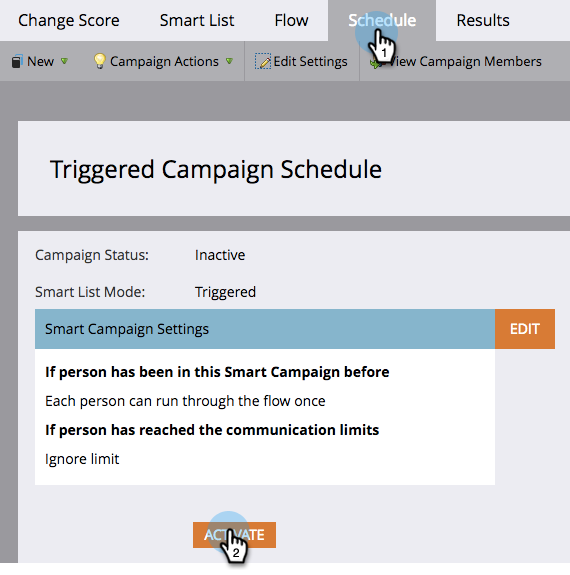

# Een slimme campagne activeren | Tabblad Planning {#activate-a-trigger-smart-campaign-schedule-tab}

Het activeren van een Smart Campaign voor trigger is vergelijkbaar met het inschakelen ervan. Dit is wat je moet doen.

1. Klik op het tabblad **[!UICONTROL Schedule]** van de slimme campagne op **[!UICONTROL Activate]** .

   

   >[!TIP]
   >
   >Controleer de slimme campagne voordat u deze activeert.

1. Klik nogmaals op **[!UICONTROL Activate]** .

   

   >[!TIP]
   >
   >Zorg ervoor dat de campagne gereed is voordat u deze activeert!

Vanaf dit moment, zal iedereen die voor de Slimme Lijst kwalificeert door de stroom gaan die door uw Slimme Campagne wordt bepaald.
