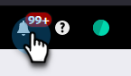

# Opruimen van campagne voor automatische activering {#automatic-trigger-campaign-cleanup}

Marketo heeft een leuke/gratis service voor het deactiveren van getriggerde slimme campagnes die geen activiteit meer krijgen. Dit versnelt de algemene systeemprestaties en bespaart u tijd.

## Wat gebeurt er? {#what-happens}

Eenmaal per kwartaal vindt Marketo Smart Campaigns die zes maanden of langer slapend (geen mensen) zitten en ze deactiveren.

## Stuur je me eerst een melding? {#will-you-notify-me-first}

Natuurlijk! Eenmaal per kwartaal ontvangt u een week van tevoren een bericht waarin elke campagne wordt getoond die we op deactivering willen toepassen.

1. Klik op het pictogram **[!UICONTROL Notifications]** .

   

1. Klik op **[!UICONTROL Idle Trigger Campaign Cleanup Scheduled]**. Klik vervolgens op de koppeling **[!UICONTROL These Idle Trigger Campaigns will be deactivated]** .

   

   Er wordt een lijst weergegeven met slimme campagnes die zijn gepland om te worden gedeactiveerd.

   

## Welke campagnes zullen worden gedeactiveerd? {#which-campaigns-will-be-deactivated}

We deactiveren alleen triggercampagnes die al meer dan zes maanden actief zijn, maar in die periode 0 mensen in aanmerking hebben laten komen.

## Wacht! Niet deze campagne! {#wait-not-this-campaign}

Maak u geen zorgen - de klok op om het even welke Slimme Campagne kan worden hersteld door:

* Een persoon die in aanmerking komt voor de campagne.
* De campagne handmatig deactiveren en opnieuw activeren.

Of zal de teller van 6 maanden terugstellen.

## Kunt u mij laten weten welke campagnes zijn gedeactiveerd? {#will-you-let-me-know-which-campaigns-were-deactivated}

Absoluut - een week na de oorspronkelijke kennisgeving zullen we de vermelde campagnes deactiveren (min alle campagnes die ten minste één persoon hebben gekwalificeerd of zijn gedeactiveerd/opnieuw geactiveerd) en een bevestigingsbericht plaatsen.

1. Selecteer de melding **[!UICONTROL Idle Trigger Campaign Cleanup Scheduled]** . Klik op de koppeling **[!UICONTROL These Idle Trigger Campaigns]** .

   

1. Er wordt een lijst met gedeactiveerde campagnes weergegeven.

   
