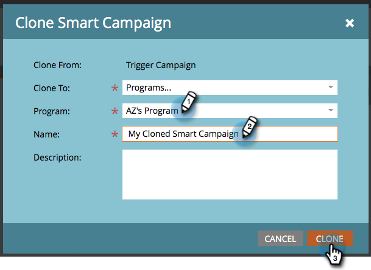

# Campagne: Een slimme campagne klonen {#campaign-actions-clone-a-smart-campaign}

Met klonen kunt u tijd besparen. Alles hoeft niet helemaal vanaf het begin te worden opgebouwd: klonen maakt een identieke campagne met exact dezelfde filters voor slimme lijsten en stroomstappen.

1. Selecteer de campagne die u wilt klonen. In de **Campagne** vervolgkeuzelijst, selecteert u **Klonen**.

   

1. Kies de juiste **Klonen naar** optie. In dit voorbeeld, kiezen **Programma&#39;s**.

   

1. Kies een **Programma**. Voer een **Campagnenaam** en klik op **Klonen**.

   

En klaar!
